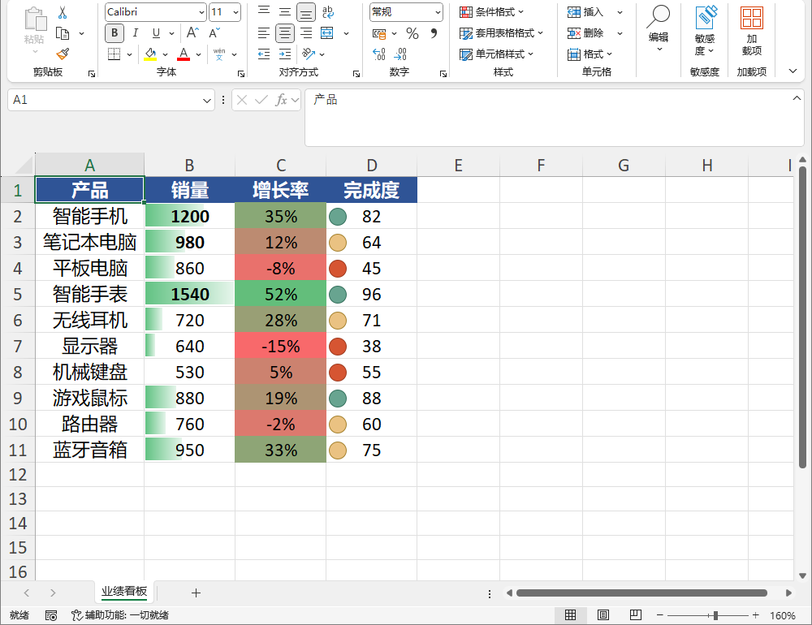
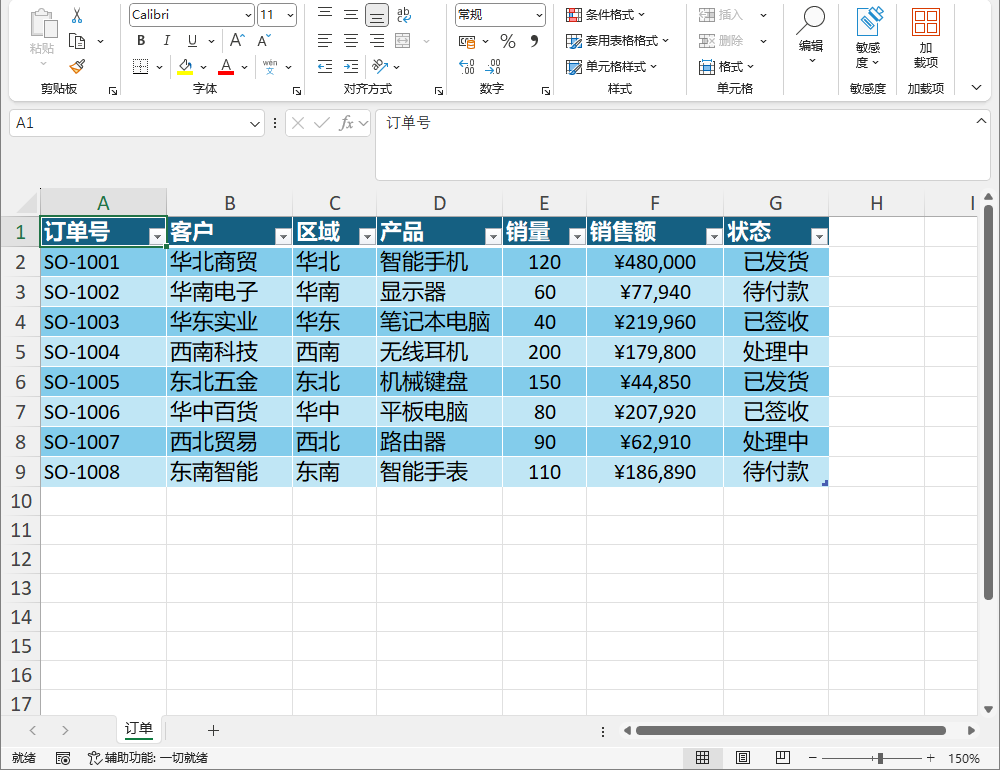
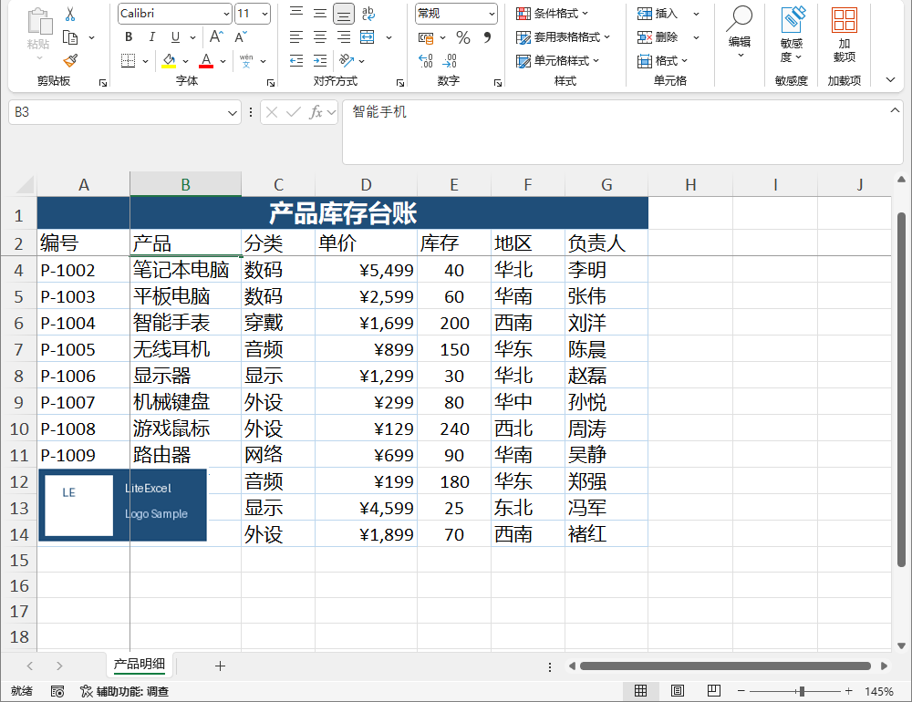
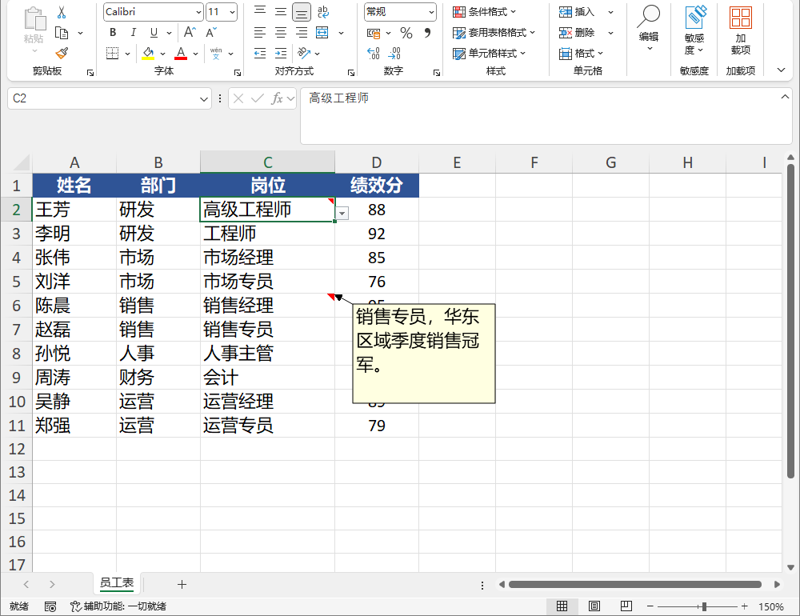
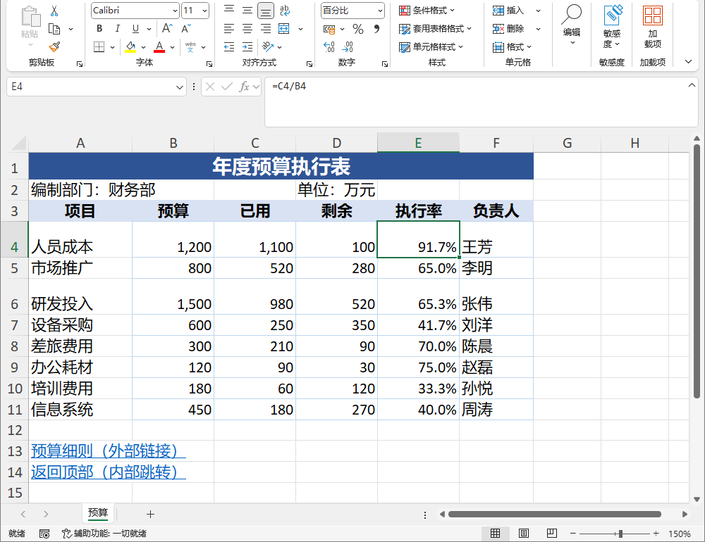

# LiteExcel.Net

[](https://www.nuget.org/packages/LiteExcel)
[](https://www.nuget.org/packages/LiteExcel)
[](https://github.com/GitHubMacrro/LiteExcel.Net/actions/workflows/ci.yml)


零第三方依赖的 .NET Excel 读写库，一套对象模型覆盖 xlsx / xlsm / xlsb / xls / csv 五种格式。目标框架 net48 与 net8.0，无需安装 Office，已通过 Native AOT smoke 测试。

> [English README](README.en.md)

## 特性

- **零第三方依赖**：只使用 .NET 基础类库，引用即用，部署包内没有额外原生组件。
- **net48 与 net8.0 双目标**：同一套 API 同时服务老项目与新项目。
- **Native AOT smoke 测试通过**：net8.0 设置 `IsAotCompatible`；反射仅用于 `List<T>` 映射，并已用 `[DynamicallyAccessedMembers]` 标注；仓库提供 Native AOT 发布 smoke（`tests/LiteExcel.AotSmoke`），覆盖 `List<T>` 映射、DataTable、条件格式等 10 组用例，本地实测通过。
- **一套对象模型覆盖五种格式**：同一段代码换个格式参数即可写出 xls 或 csv。
- **常用表格能力**：样式与数字格式、合并、行高列宽、自动筛选、批注、数据验证、超链接、冻结窗格、图片、条件格式、超级表、命名区域、公式、文件级密码、`List<T>` / DataTable 映射、流式读写。
- **高级内容以保留为主**：图表、透视表、切片器、VBA 宏、Power Query、数据模型、外部连接、ActiveX 形状等高级内容在打开-保存时按既定路径保留，而不是作为对象模型的一部分去创建或修改。

### 五种格式一览

| 格式 | 读取 | 创建 / 编辑 | 高级内容保留 | 流式读 | 流式写 |
|---|---|---|---|---|---|
| xlsx / xlsm | 支持 | 支持 | 支持 | 支持 | 支持 |
| xlsb | 支持 | 部分（样式仅数字格式） | 支持（含另存为 xlsx / xlsm） | 支持 | 不支持 |
| xls | 支持 | 部分（样式仅数字格式） | 不支持（降级上报） | 支持 | 不支持 |
| csv | 仅文本值 | 仅文本 | — | 不支持 | 不支持 |

> `Excel.Open` / `Read<T>` / `ReadSheet` / `ReadAsDataTable` / `GetSheetNames` 按扩展名自动路由，五种格式均支持读取；流式逐行读取支持 xlsx / xlsm / xlsb / xls（csv 除外）。逐项能力明细见[使用手册 §20.1](docs/USAGE.zh-CN.md#201-格式能力矩阵)。

### 能力边界：可编辑 / 可保留 / 会降级

LiteExcel.Net 的能力分为三类，理解这三类即可判断某项功能在具体格式下的行为：

- **可编辑**：能读取、修改并写回。
- **可保留**：不能作为对象模型的一部分直接编辑，但在满足相应保存路径条件时，打开-保存会原样保留。
- **会降级**：目标格式无法表达时，保存时**逐项上报**（可通过 `Workbook.SaveDegradations` 查询，或经 `ExcelWriteOptions.OnDegradation` 回调获取），不做静默丢弃。

三组区别：

- **可编辑 ≠ 可保留**：能修改的内容不一定通过"保留"实现，反之亦然。
- **可保留 ≠ 可修改**：高级内容可以被原样保留，但不提供创建 / 修改 API。
- **不支持 ≠ 静默丢失**：不支持的能力在写出时会显式上报，而不是悄悄丢弃。

### 高级内容与跨格式

图表、透视表、切片器、VBA 宏、Power Query、数据模型、外部连接、ActiveX 形状等高级内容，主要通过**保留机制**跨越读写过程，而不是作为对象模型的一部分去创建或修改。

- **打开-保存保留**：xlsx / xlsm / xlsb 上的上述高级内容在打开-保存时按既定路径保留；xls 不做保真透传（降级上报）。
- **跨格式保留（xlsb → xlsx / xlsm）**：打开 `.xlsb` 另存为 `.xlsx` / `.xlsm` 时，透视表、切片器、Power Query、数据模型、图形等高级内容可通过转码保留（默认启用）。

> 高级内容保留依赖既定的转码 / 保真路径。含 Power Query / 数据模型的 `.xlsb` 上，部分会触发整本重建的操作存在已知限制，详见[使用手册](docs/USAGE.zh-CN.md)。

## 为什么选择 LiteExcel.Net

- **Lightweight**：零第三方依赖、单包分发，不依赖 Excel / Office 安装。
- **Focused API**：围绕常见表格操作提供一套统一对象模型，五种格式共用同一 API。
- **Explicit behavior**：能力边界明确——能编辑的、只能保留的、会降级的都会讲清楚，不支持的内容不做静默丢弃。

## 效果预览

<details>
<summary>效果预览（LiteExcel.Net 写出的文件在 Excel 中打开的实际效果）</summary>

[](docs/screenshots/conditional.png)

[](docs/screenshots/table_filter.png)

[](docs/screenshots/image_freeze.png)

[](docs/screenshots/style_number.png)

[](docs/screenshots/comment_validation.png)

[](docs/screenshots/merge_link.png)

</details>

## 安装

项目 / 仓库名为 **LiteExcel.Net**，NuGet 包名为 **LiteExcel**：

```powershell
dotnet add package LiteExcel
```

使用本地打包的 nupkg 时，指定包目录作为源：

```powershell
dotnet add package LiteExcel --source .\packages
```

## 快速上手

以下示例适用于 net48 与 net8.0。

**对象模型读写**：新建工作簿，按自然层级写入，再次打开读取。

```csharp
using LiteExcel;

var wb = Excel.Create();
var ws = wb.Worksheets["Sheet1"];
ws.SetValue("A1", "姓名");
ws.SetValue("B1", "年龄");
ws.SetValue("A2", "张三");
ws.SetValue("B2", 25);
ws.Range("A1:B1").Style = new CellStyle { Bold = true };
wb.SaveAs("output.xlsx");

var opened = Excel.Open("output.xlsx");
var name = opened.Worksheets[0].Cell("A2").GetString();
var age = opened.Worksheets[0].Cells[2, 2].GetDouble();
```

`List<T>` 映射、DataTable、低层 `SheetData` 读写见[使用手册第 2 章](docs/USAGE.zh-CN.md#2-数据读写)与[附录 B](docs/USAGE.zh-CN.md#附录-b-低层-api-参考)。

## 文档

- [使用手册（中文）](docs/USAGE.zh-CN.md)：完整说明与示例
- [Usage Guide (English)](docs/USAGE.en.md)：英文使用指南
- [更新日志](docs/CHANGELOG.md)：版本变更记录
- [English README](README.en.md)

仓库自带控制台示例（33 个 Demo，覆盖读写 / 样式 / 筛选 / 批注 / 密码 / 图片 / 条件格式 / 插删行列 / 公式写回等），在仓库根目录执行：

```powershell
dotnet run --project demo/LiteExcel.Demo
```

输出写入程序目录下的 `Output` 文件夹，控制台会打印完整路径。

## 项目状态

LiteExcel.Net 是一个持续维护中的开源项目。核心 API 已趋于稳定，部分高级能力仍可能继续演进。

当前已知限制：

1. **CSV**：单工作表、纯文本，无样式，数值以文本读回。
2. **密码与宏**：xls 不支持密码；含宏的工作簿只能存为 xlsm 或 xlsb。
3. **高级内容**：图表、透视表等只保留不编辑；xls / csv 不支持。含 Power Query / 数据模型的 `.xlsb` 上，部分会触发整本重建的操作存在已知限制（会显式上报）。
4. **流式写入与追加**：`Excel.CreateWriter` / `Excel.Append` 仅支持 xlsx / xlsm（流式读取的范围另见「五种格式一览」）。
5. **样式**：xls / xlsb 仅支持数字格式，其余样式在写出时降级上报。

## 路线图

以下是项目方向，不代表时间或版本承诺：

- **Next**：提升含 Power Query / 数据模型的工作簿在删除工作表时的可靠性（研究中）。当前已对「无法逐字节保真、只能整本重建」的保存路径加了保守安全网（宽松模式产出并上报，严格模式阻止），底层重建兼容性仍待完善。
- **Candidate**：XLSB 命名区域写出；XLSB InCell 图片；公式写回增强（数组公式 / 3D 引用 / 命名区域）；xlsb / xls 的流式写入。

## 参与贡献

欢迎通过 issue、discussion 或 pull request 参与。

## 许可证

MIT [LICENSE](LICENSE)。
