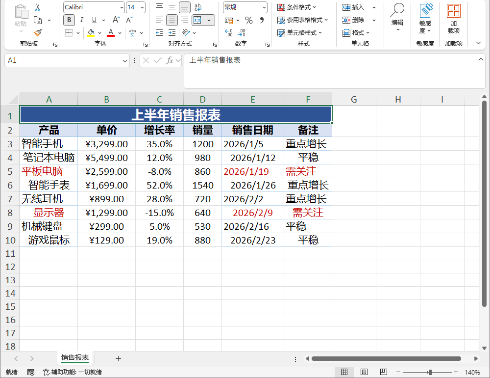
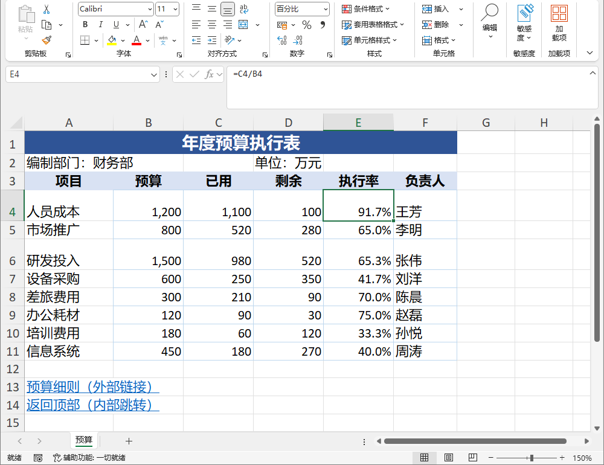
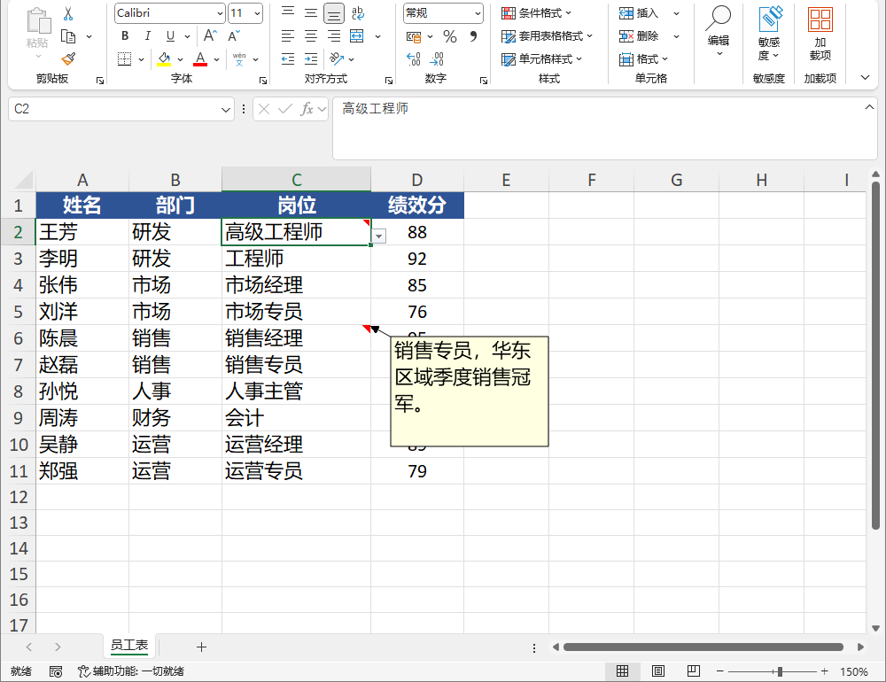
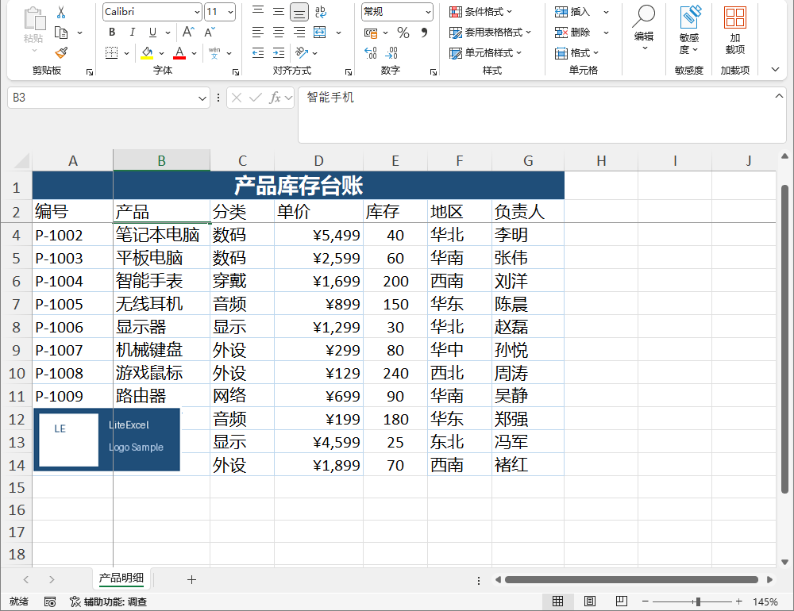
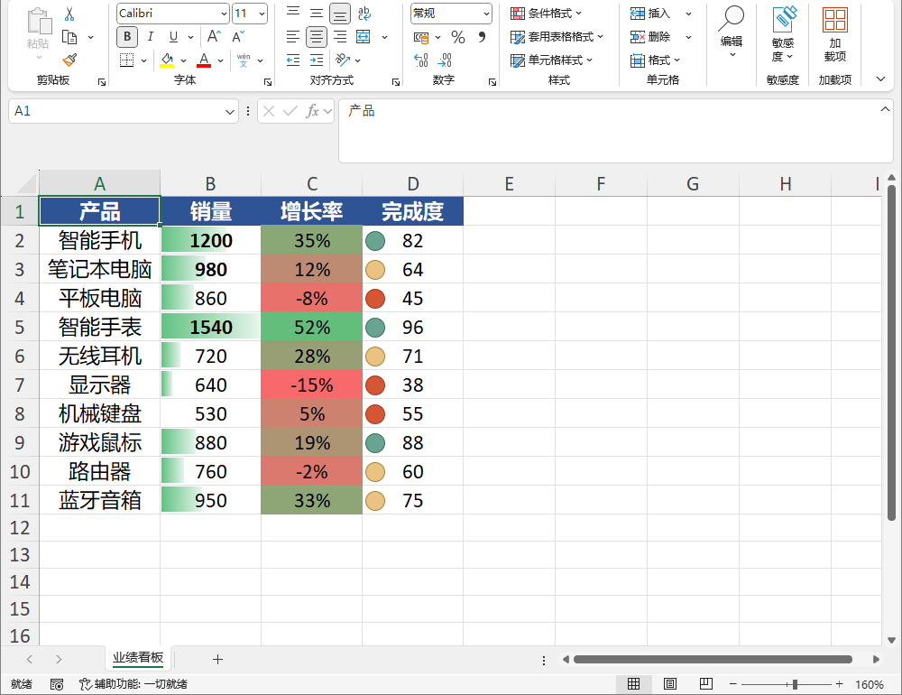
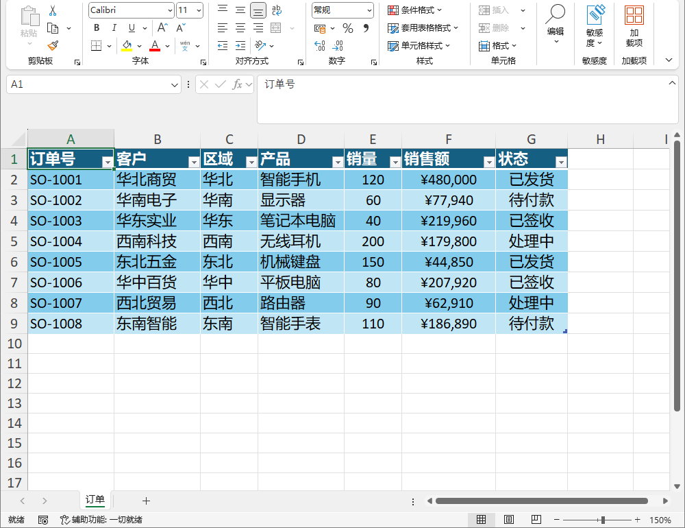

# LiteExcel 使用手册

> 无需安装 Excel 即可读写 Excel 文件的 .NET 库，支持 xlsx / xlsm / xls / xlsb / csv 五种格式，面向 net48 与 net8.0。
> 术语约定：**工作簿**指 Workbook，对应一个 Excel 文件；**工作表**指 Worksheet，对应文件内的一张工作表。**对象模型 API** 指以 `Excel` → `Workbook` → `Worksheet` → `Cell`/`Cells`/`Range` 为主线的日常用法；**低层 API** 指 `SheetData` / `XlsxReader` / `XlsxWriter` / `XlsxStreamWriter` 等裸数据入口。

---

## 📚 全文目录

| # | 章节 |
| :-: | :--- |
| **入门** | |
| 1 | [安装与引用](#1-安装与引用) |
| 2 | [快速上手](#2-快速上手) |
| **对象模型** | |
| 3 | [文件导航](#3-文件导航) |
| 4 | [单元格与取值](#4-单元格与取值) |
| 5 | [数据类型与转换](#5-数据类型与转换) |
| 6 | [样式](#6-样式) |
| 7 | [合并单元格](#7-合并单元格) |
| 8 | [自动筛选](#8-自动筛选) |
| 9 | [行高与列宽](#9-行高与列宽) |
| 10 | [批注](#10-批注) |
| 11 | [超链接](#11-超链接) |
| 12 | [冻结窗格](#12-冻结窗格) |
| 13 | [图片](#13-图片) |
| 14 | [数据验证](#14-数据验证) |
| 15 | [条件格式](#15-条件格式) |
| 16 | [超级表](#16-超级表) |
| 17 | [命名区域](#17-命名区域) |
| 18 | [文件级密码](#18-文件级密码) |
| 19 | [工作表 / 工作簿保护](#19-工作表--工作簿保护) |
| **多格式与平台** | |
| 20 | [多格式行为](#20-多格式行为) |
| 21 | [流式读取 / 进度回调 / 追加数据](#21-流式读取--进度回调--追加数据) |
| 22 | [降级回调 OnDegradation](#22-降级回调-ondegradation) |
| 23 | [AOT 兼容性](#23-aot-兼容性) |
| **运维与注意** | |
| 24 | [异常处理](#24-异常处理) |
| **附录** | |
| A | [对象模型速查](#附录-a-对象模型速查) |
| B | [低层 API 参考](#附录-b-低层-api-参考) |

---

# 1. 安装与引用

本章讲库的获取方式与使用前提。

## 📑 目录

| # | 章节 | 说明 |
| :-: | :--- | :--- |
| 1.1 | [获取库](#11-获取库) | NuGet 安装 / 源码引用 |
| 1.2 | [使用准备](#12-使用准备) | 命名空间 / 目标框架 |

---

## 1.1 获取库

**NuGet 安装（推荐）**：生产项目通过 NuGet 包引入，一条命令完成：

```powershell
dotnet add package LiteExcel
```

也可以在 Visual Studio 的「管理 NuGet 程序包」中搜索 `LiteExcel` 安装。

**从源码本地引用**：包未发布或需联调库源码时，通过 csproj 项目引用引入：

```xml
<ItemGroup>
  <ProjectReference Include="..\src\LiteExcel\LiteExcel.csproj" />
</ItemGroup>
```

> 生产项目请优先使用 NuGet 包；源码引用仅用于本地联调库源码或包尚未发布时。

## 1.2 使用准备

**命名空间**：所有类型都在 `LiteExcel` 命名空间下：

```csharp
using LiteExcel;
```

**目标框架**：库同时面向 net48 与 net8.0。net8.0 目标额外声明 `IsAotCompatible=true`，全部公开 API 兼容 Native AOT 与裁剪（见第 23 章）。

---

# 2. 快速上手

用对象模型 API 走一遍「新建 → 写值 → 保存 → 打开 → 读回」的完整闭环：

```csharp
using LiteExcel;

// 新建工作簿（默认含 Sheet1）
var wb = Excel.Create();
var ws = wb.Worksheets["Sheet1"];

// 写入数据，首行存列名
ws.SetValue("A1", "Name");
ws.SetValue("B1", "Age");
ws.SetValue("A2", "Zhang San");
ws.SetValue("B2", 25);
ws.SetValue("A3", "Li Si");
ws.SetValue("B3", 30);

wb.SaveAs("report.xlsx");                      // 保存到磁盘

// 读回
var opened = Excel.Open("report.xlsx");
var sheet = opened.Worksheets[0];
Console.WriteLine(sheet.Cell("A2").GetString());
Console.WriteLine(sheet.Cell("B2").GetDouble());
```

输出：

```
Zhang San
25
```

---

# 3. 文件导航

本章介绍文件层面的操作：从哪打开、往哪保存、建新簿、查表名，外加工作表与文档属性的管理。

> ⚠️ **重要限制**
> 本库 **不创建、不编辑** 图表（Chart）与数据透视表（PivotTable）。
> 打开 xlsx / xlsm / xlsb 再保存时这些元素原样透传保留；xls / csv 无保留机制，打开再保存会丢失，覆盖源文件前请先另存副本。

## 📑 目录

| # | 章节 | 说明 |
| :-: | :--- | :--- |
| 3.1 | [格式 `ExcelFormat`](#31-格式-excelformat) | 支持的文件格式与自动识别 |
| 3.2 | [打开工作簿](#32-打开工作簿) | 从路径 / 流打开，读取选项 |
| 3.3 | [新建工作簿](#33-新建工作簿) | 空簿创建、从数据源创建 |
| 3.4 | [工作表：查询与管理](#34-工作表查询与管理) | 查询表名、增删移动遍历 |
| 3.5 | [保存与写出](#35-保存与写出) | Save / SaveAs / Write，写入选项 |
| 3.6 | [文档属性 `WorkbookProperties`](#36-文档属性-workbookproperties) | 读写 `WorkbookProperties` |

---

## 3.1 格式 ExcelFormat

```csharp
public enum ExcelFormat { Xlsx, Xlsm, Xlsb, Xls, Csv }
```

`Excel.Open` 按扩展名自动选后端。两种情况需要显式传 `format`：扩展名与内容不符，或从流读取（流没有扩展名）。

```csharp
Excel.DetectFormat("report.xlsx")   // → ExcelFormat.Xlsx，按扩展名判断
wb.Format                           // 当前工作簿格式，保存时沿用
```

> `SaveAs(path, format)` 要求路径扩展名与格式一致，否则抛 `LiteExcelException`。

## 3.2 打开工作簿

**路径打开**：扩展名对得上就不用管格式。

```csharp
var wb = Excel.Open("report.xlsx");
var wb2 = Excel.Open("data.csv");              // 自动识别为 Csv
var wb3 = Excel.Open("legacy.xls");            // 自动识别为 Xls
```

扩展名和内容对不上时，显式指定格式：

```csharp
var wb = Excel.Open("data.bin", ExcelFormat.Xlsx);
```

**流打开**：必须显式给格式。输入流不会被关闭，由调用方管理；不可定位的流（如网络流）会在内部复制到内存。

```csharp
using var fs = File.OpenRead("report.xlsx");
var wb = Excel.Open(fs, ExcelFormat.Xlsx);
// 打开后 CurrentPath 为 null，需用 SaveAs 指定保存路径
wb.SaveAs("copy.xlsx");
```

输出：

```
已写入 copy.xlsx
```

**读取选项**：`Open` 的第二个参数。

```csharp
var wb = Excel.Open("secured.xlsx", new ExcelReadOptions
{
    OpenPassword = "secret",
    ModifyPassword = "write",
    FillMergedCells = true,
    Separator = ';',
});
```

| 参数 | 类型 | 说明 |
| --- | --- | --- |
| `OpenPassword` | `string?` | 打开密码，解密带密码的 xlsx / xlsm / xlsb |
| `ModifyPassword` | `string?` | 修改密码（写保护），提供后获得编辑 / 保存权限 |
| `FillMergedCells` | `bool` | 把合并区左上角的值展开到整个合并区域，默认 `false` |
| `Separator` | `char?` | 仅 CSV 生效，`null` 时自动探测 |
| `ReadStyles` | `bool` | 是否读取样式，默认 `true` |
| `LeaveOpen` | `bool` | 读完后是否保持输入流打开，默认 `false` |

## 3.3 新建工作簿

```csharp
var wb1 = Excel.Create();                    // 空簿，默认 Sheet1
Console.WriteLine(wb1.Worksheets[0].Name);   // 打印验证：默认表名

var wb2 = Excel.Create("Data");              // 指定首个工作表名
var wb3 = Excel.Create(new[] { "Q1", "Q2", "Q3" });   // 批量建表
var wb4 = Excel.Create(ExcelFormat.Xlsm);    // 指定格式
```

一步建簿并写数据（`List<T>`、`DataTable`）：

```csharp
var people = new List<Person> { new() { Name = "A", Age = 1 } };
var wb5 = Excel.Create(people, "People");    // 首行为表头

var dt = new System.Data.DataTable("T");
dt.Columns.Add("X");
dt.Rows.Add("v");
var wb6 = Excel.Create(dt);                  // sheetName 为空时用 TableName
```

`sheetName` 缺省时取数据源的 `TableName`，再空则回落到 `Sheet1`；`configure` 是 `List<T>` 写出时的映射配置，见第 5 章。

输出：

```
Sheet1
```

## 3.4 工作表：查询与管理

**只取表名**：不必加载整个工作簿。

```csharp
var names = Excel.GetSheetNames("report.xlsx");   // List<string>
using var stream = File.OpenRead("report.xlsx");
var names2 = Excel.GetSheetNames(stream);         // 仅 xlsx/xlsm
```

> `GetSheetNames(path)` 对 xlsx / xlsm 直接读元数据；xlsb / xls / csv 会走 `Excel.Open` 解析。流重载只支持 xlsx / xlsm，取 xlsb 表名请用 `Excel.Open(stream, ExcelFormat.Xlsb).Worksheets.Names`。

**增删、移动、访问**都在 `Workbook.Worksheets`：

```csharp
var wb = Excel.Create();
var ws = wb.Worksheets["Sheet1"];         // 按名称访问（不存在抛 LiteExcelException）
var first = wb.Worksheets[0];             // 按索引访问（0-based）
Console.WriteLine(wb.Worksheets.Count);   // 数量
Console.WriteLine(string.Join(", ", wb.Worksheets.Names));   // 所有表名
Console.WriteLine(wb.Worksheets.Contains("Sheet1"));         // true

wb.Worksheets.Add("Data");                // 新增空表
wb.Worksheets.Add("People", peopleList);  // 新增表并写 List<T>（首行表头）
wb.Worksheets.Add("T", dataTable);        // 新增表并写 DataTable（首行列名）
wb.Worksheets.Move(0, 2);                 // 移动顺序（0-based）
wb.Worksheets.Remove("Data");             // 按名称删除（存在返回 true）
wb.Worksheets.RemoveAt(0);                // 按索引删除
```

遍历工作表：

```csharp
foreach (var sheet in wb.Worksheets)
    Console.WriteLine(sheet.Name);
```

输出：

```
1
Sheet1
True
Sheet1
T
```

> ⚠️ 表名校验规则见第 24 章：含 `\ / ? * [ ] :` 或超 31 字符的表名，保存时抛 `InvalidSheetNameException`。

## 3.5 保存与写出

**实例方法**：`Save` 存到 `CurrentPath`，`SaveAs` 指定新路径。

```csharp
wb.Save();                    // 保存到 CurrentPath
wb.SaveAs("out.xlsx");        // 另存，沿用当前格式
wb.SaveAs("out.xlsm", ExcelFormat.Xlsm);   // 另存并转格式
wb.Save(new FileStream("s.xlsx", FileMode.Create), ExcelFormat.Xlsx);  // 存到流
```

输出：

```
已写入 out.xlsx / out.xlsm / s.xlsx
```

**静态方法**：工作簿是临时构建、不需要回写原路径时用。

```csharp
Excel.Write("out.xlsx", wb);
Excel.Write("out.xlsx", wb, new ExcelWriteOptions { AutoFitColumns = true });
wb.Save(stream, ExcelFormat.Xlsx);          // 写到一个流
```

**写入选项**：

```csharp
Excel.Write("out.xlsx", wb, new ExcelWriteOptions
{
    Overwrite = true,
    AutoFitColumns = true,
    FreezeHeader = true,
    Properties = new WorkbookProperties { Creator = "Me" },
    OnDegradation = info => Console.WriteLine(info.Capability),
    Separator = ';',
});
```

| 参数 | 类型 | 说明 |
| --- | --- | --- |
| `Overwrite` | `bool` | 目标已存在时是否覆盖，默认 `true` |
| `AutoFitColumns` | `bool` | 写出前自动估算列宽，默认 `false` |
| `FreezeHeader` | `bool` | 写出时冻结表头，默认 `false` |
| `Properties` | `WorkbookProperties?` | 覆盖文档属性，见 3.6 |
| `OnDegradation` | `Action<DegradationInfo>?` | 能力降级回调，写出到不支持某能力的格式时逐项上报 |
| `Separator` | `char?` | 仅 CSV 生效，`null` 时默认逗号 |
| `LeaveOpen` | `bool` | 写完后是否保持输出流打开，默认 `false` |

输出：

```
已写入 out.xlsx
```

文件级密码（打开 / 修改）仅支持 xlsx / xlsm / xlsb，存为 csv / xls 时若带密码会报错。这类「目标格式不支持某能力」的情况都会经 `OnDegradation` 逐项上报，挂个回调就能拿到清单。

> ⚠️ **重要限制**
> 含 VBA 宏的工作簿不允许存为 xlsx / xls（不支持宏的格式），会提前报错。覆盖源文件前请先另存副本。

## 3.6 文档属性 WorkbookProperties

> ⚠️ **重要限制**
> 仅支持 xlsx / xlsm / xlsb。写出 xls 时属性静默丢失，经 `OnDegradation` 上报。

`Workbook.Properties` 对应 xlsx 包内的 `docProps/core.xml` 与 `docProps/app.xml`：

```csharp
var wb = Excel.Create();
wb.Properties.Creator = "JackZ";
wb.Properties.LastModifiedBy = "Me";
wb.Properties.Created = DateTime.Now;
wb.Properties.Modified = DateTime.Now;
wb.Properties.Title = "季度报告";
wb.Properties.Subject = "财务";
wb.Properties.Application = "LiteExcel";
wb.SaveAs("props.xlsx");
```

`Creator`（作者，dc:creator）、`LastModifiedBy`（最后保存者）、`Created` / `Modified`（创建与最后修改时间）、`Title` / `Subject`（标题与主题）、`Application`（应用程序名，`null` 时写出取宿主程序集名）。

写出时覆盖属性：

```csharp
Excel.Write("out.xlsx", wb, new ExcelWriteOptions
{
    Properties = new WorkbookProperties { Creator = "Bot", Title = "Auto" },
});
```

读回文档属性：

```csharp
var opened = Excel.Open("props.xlsx");
Console.WriteLine(opened.Properties.Creator);    // JackZ
Console.WriteLine(opened.Properties.Title);      // 季度报告
```

输出：

```
JackZ
季度报告
```

---

# 4. 单元格与取值

本章讲单元格的访问与取值：按坐标或地址定位、写值、整表入口、区域批量操作，以及强类型读取。

> ⚠️ **重要限制**
> 坐标统一 **1-based**（首行首列为 1,1）；A1 地址如 `B3` 表示第 2 行第 3 列。

## 📑 目录

| # | 章节 | 说明 |
| :-: | :--- | :--- |
| 4.1 | [按坐标 / 地址访问单元格](#41-按坐标--地址访问单元格) | 按坐标或 A1 地址定位 |
| 4.2 | [写入值 `SetValue`](#42-写入值-setvalue) | 越界自动扩展网格 |
| 4.3 | [集合式访问 `Cells`](#43-集合式访问-cells) | 整表入口与索引器 |
| 4.4 | [区域操作 `ExcelRange`](#44-区域操作-excelrange) | 批量读写、样式、合并、清空 |
| 4.5 | [单元格读取方法](#45-单元格读取方法) | 强类型与 Try 读取 |
| 4.6 | [`Value` 属性](#46-value-属性) | 便捷读写（单格标量 / 多格数组） |

---

## 4.1 按坐标 / 地址访问单元格

`Worksheet.Cell` 提供按行列或 A1 地址访问：

| 参数 | 类型 | 说明 |
| --- | --- | --- |
| `row` / `column` | `int` | 1-based 行列坐标，如 `(1, 1)` 即 A1 |
| `address` | `string` | A1 地址，如 `"B3"` |

```csharp
var ws = Excel.Create().Worksheets["Sheet1"];

var c1 = ws.Cell(1, 1);        // A1
var c2 = ws.Cell("B3");        // B3
Console.WriteLine(c1.IsEmpty);   // True（尚未赋值）
```

`Cell` 是引用类型，访问不存在的单元格返回一个 `Empty` 占位；一旦赋值即落入网格。

输出：

```
True
```

## 4.2 写入值 SetValue

`Worksheet.SetValue` 越界自动扩展网格；`null` / `DBNull` 写空单元格：

| 参数 | 类型 | 说明 |
| --- | --- | --- |
| `row` / `column` | `int` | 1-based 坐标，越界自动扩展网格 |
| `address` | `string` | A1 地址 |
| `value` | `object?` | 任意值；`null` / `DBNull` 写空单元格 |

```csharp
var ws = Excel.Create().Worksheets["Sheet1"];

ws.SetValue(1, 1, "Header");
ws.SetValue("A2", 42);
ws.SetValue("B2", null);       // 清空 B2
Console.WriteLine(ws.Cell("A2").GetString());   // 42
```

输出：

```
42
```

## 4.3 集合式访问 Cells

`Worksheet.Cells` 提供整表入口，支持索引器、区域提取、枚举与批量清空：

| 成员 | 类型 | 说明 |
| --- | --- | --- |
| `Cells[int row, int column]` | `Cell` | 索引器，1-based |
| `Cells[string address]` | `Cell` | 索引器，A1 地址 |
| `Cells.SetValue(...)` | `void` | 便捷写值 |
| `Cells.Range(...)` | `ExcelRange` | 提取区域 |
| `Cells.Clear()` | `void` | 清空整表值（不删行列） |

```csharp
var ws = Excel.Create().Worksheets["Sheet1"];

ws.Cells[1, 1] = "A1 via cells";      // 索引器（行列）
ws.Cells["B1"] = "B1 via cells";      // 索引器（A1 地址）
ws.Cells.SetValue("C1", 3.14);        // 便捷写值

var range = ws.Cells.Range("A1:D10"); // 提取区域
foreach (var cell in ws.Cells)        // 枚举网格中已有单元格
    Console.WriteLine(cell.GetString());
ws.Cells.Clear();                     // 清空整表值（不删行列）
```

输出：

```
A1 via cells
B1 via cells
3.14
```

## 4.4 区域操作 ExcelRange

`Worksheet.Range` 返回连续矩形区域（1-based，含端点），支持批量读写、样式、合并、清空、枚举：

| 成员 | 类型 | 说明 |
| --- | --- | --- |
| `Address` | `string` | A1 区域地址，如 `"A1:D10"` |
| `RowCount` / `ColumnCount` | `int` | 行数 / 列数 |
| `Fill(object? value)` | `void` | 整区填相同值 |
| `Fill(object?[,] data)` | `void` | 二维数组写入 |
| `ToValues()` | `object?[,]` | 值读回 |
| `ToCells()` | `Cell[,]` | 单元格读回 |
| `Style` | `CellStyle?` | 区域内全部单元格套用样式，见第 6 章 |
| `Merge()` / `Unmerge()` | `void` | 合并 / 取消合并该区域，见第 7 章 |
| `Clear()` | `void` | 清空区域内值 |
| `Cell(rowOffset, colOffset)` | `Cell` | 区域内相对偏移，0-based |

```csharp
var ws = Excel.Create().Worksheets["Sheet1"];

var r = ws.Range("A1:D10");          // 或 ws.Range(1, 1, 10, 4)
Console.WriteLine(r.Address);        // "A1:D10"
Console.WriteLine($"{r.RowCount} x {r.ColumnCount}");  // 10 x 4

r.Fill("x");                          // 整区填相同值
r.Fill(new object?[,] { { "a", "b" }, { "c", "d" } }); // 二维数组写入
var vals = r.ToValues();              // object?[,] 读回
var cells = r.ToCells();              // Cell[,] 读回
r.Style = new CellStyle { Bold = true };  // 整区统一样式
r.Merge();                            // 合并该区域
r.Unmerge();                          // 取消合并
r.Clear();                            // 清空区域内值

var single = r.Cell(0, 0);            // 区域内相对偏移（0-based）
```

输出：

```
A1:D10
10 x 4
```

## 4.5 单元格读取方法

`Cell` 提供强类型与 Try 风格读取：

| 方法 | 返回 | 说明 |
| --- | --- | --- |
| `GetString()` | `string?` | 文本 / 数字 / 日期 / 布尔按惯例格式化 |
| `GetDouble()` | `double` | 类型不匹配抛 `InvalidCastException` |
| `GetDateTime()` | `DateTime` | 日期读取 |
| `GetBoolean()` | `bool` | 布尔读取 |
| `GetValue()` | `object?` | 原始对象，`Empty` 返回 `null` |
| `TryGetString` / `TryGetDouble` / `TryGetDateTime` / `TryGetBoolean` | `bool` | 空单元格返回 `false`，失败不抛异常 |

```csharp
var ws = Excel.Create().Worksheets["Sheet1"];

var cell = ws.Cell("A1");
string? s = cell.GetString();        // 文本 / 数字 / 日期 / 布尔按惯例格式化
double d = cell.GetDouble();         // 类型不匹配抛 InvalidCastException
DateTime dt = cell.GetDateTime();
bool b = cell.GetBoolean();
object? raw = cell.GetValue();       // 原始对象，Empty 返回 null

bool ok = cell.TryGetString(out var s2);   // 空单元格返回 false
bool ok2 = cell.TryGetDouble(out double d2);
bool ok3 = cell.TryGetDateTime(out DateTime dt2);
bool ok4 = cell.TryGetBoolean(out bool b2);
```

## 4.6 Value 属性

`Cell.Value` 与 `ExcelRange.Value` 是 `SetValue` / `GetValue` 的便捷属性写法，与 Excel interop 的习惯一致。读取返回 `object?`，需要类型安全时仍用 4.5 的 `GetString()` / `GetDouble()` 等。

```csharp
var ws = Excel.Create().Worksheets["Sheet1"];

// 单格：读写标量（Cell / Cells 索引器 / 单格 Range 均可）
ws.Cell("A1").Value = "123";
Console.WriteLine(ws.Cell("A1").Value);        // 123
ws.Cells["B2"].Value = 42;
ws.Cells[3, 3].Value = true;
ws.Range("C1").Value = "经 Range 写";

// 多格 Range：读返回 object?[,]（尺寸 = 区域），写标量铺满 / 写二维数组按位填
ws.Range("A10:B11").Value = "x";                          // 4 格全为 x
var grid = (object?[,])ws.Range("A10:B11").Value;         // 读 2D
ws.Range("D1:E2").Value = new object?[,] { { 1, 2 }, { 3, 4 } };
```

`ExcelRange.Value` 行为：单格区域（1×1）读写标量；多格区域读返回 `object?[,]`、写标量等价 `Fill`、写二维数组等价 `Fill(object?[,])`。

---

# 5. 数据类型与转换

本章讲单元格值的类型体系：五种 `CellType`、工厂方法、`SetValue` 自动类型转换、数字格式、读取时日期识别、公式，以及 List\<T\> / DataTable 映射。

## 📑 目录

| # | 章节 | 说明 |
| :-: | :--- | :--- |
| 5.1 | [单元格类型 `CellType`](#51-单元格类型-celltype) | 五种 CellType |
| 5.2 | [工厂方法](#52-工厂方法) | 从值 / 公式构造 Cell |
| 5.3 | [自动类型转换](#53-自动类型转换) | SetValue 按 CLR 类型映射 |
| 5.4 | [可空类型](#54-可空类型) | int? / DateTime? |
| 5.5 | [数字格式速查](#55-数字格式速查) | Excel 格式代码 |
| 5.6 | [读取时日期自动识别](#56-读取时日期自动识别) | 内置日期格式自动判定 |
| 5.7 | [公式](#57-公式) | Formula 独立字段 |
| 5.8 | [Byte[]](#58-byte) | 二进制数据处理 |
| 5.9 | [List\<T\> 映射与 LiteColumn](#59-listt-映射与-litecolumn) | 列名 / 顺序 / 格式 / 公式 |
| 5.10 | [List\<T\> Fluent 配置](#510-listt-fluent-配置writeoptionst--readoptionst) | Fluent API / 字典映射 |
| 5.11 | [DataTable 便利 API](#511-datatable-便利-api) | 免反射映射，AOT 安全 |

---

## 5.1 单元格类型 CellType

```csharp
public enum CellType { Text, Number, Date, Boolean, Empty }
```

`Cell.Type` 决定哪个值字段有效：`Text` / `Number` / `Date` / `Boolean`。`IsEmpty` 表示空单元格。

## 5.2 工厂方法

| 方法 | 返回 | 说明 |
| --- | --- | --- |
| `FromText(string?)` | `Cell` | 文本单元格 |
| `FromNumber(double, string?)` | `Cell` | 数字单元格，可带数字格式 |
| `FromDate(DateTime, string?)` | `Cell` | 日期单元格，默认格式 `yyyy-MM-dd` |
| `FromBoolean(bool)` | `Cell` | 布尔单元格 |
| `FromFormula(string)` | `Cell` | 公式单元格，仅写公式字符串，不计算结果 |
| `Empty` | `Cell` | 空单元格占位 |

```csharp
var t = Cell.FromText("hello");
var n = Cell.FromNumber(42, "#,##0.00");      // 可带数字格式
var d = Cell.FromDate(new DateTime(2024, 1, 1));  // 默认格式 yyyy-MM-dd
var b = Cell.FromBoolean(true);
var f = Cell.FromFormula("SUM(A1:A3)");        // 公式单元格
var e = Cell.Empty;
Console.WriteLine(d.GetString());   // 默认日期格式 yyyy-MM-dd
```

输出：

```
2024-01-01
```

## 5.3 自动类型转换

`SetValue(object?)` 按 CLR 类型自动映射：

| CLR 类型 | 单元格类型 |
| --- | --- |
| `bool` | `Boolean` |
| `DateTime` | `Date`（默认 `yyyy-MM-dd`） |
| `sbyte/byte/short/ushort/int/uint/long/ulong/float/double/decimal` | `Number` |
| `null` / `DBNull` | `Empty` |
| 其他（含 `string`） | `Text` |

```csharp
var ws = Excel.Create().Worksheets["Sheet1"];

ws.SetValue("A1", 3.14);        // Number
ws.SetValue("A2", true);        // Boolean
ws.SetValue("A3", DateTime.Now); // Date
ws.SetValue("A4", "text");      // Text
ws.SetValue("A5", null);        // Empty

Console.WriteLine(ws.Cell("A1").Type);   // Number
Console.WriteLine(ws.Cell("A2").Type);   // Boolean
Console.WriteLine(ws.Cell("A3").Type);   // Date
Console.WriteLine(ws.Cell("A4").Type);   // Text
Console.WriteLine(ws.Cell("A5").Type);   // Empty
```

输出：

```
Number
Boolean
Date
Text
Empty
```

## 5.4 可空类型

`SetValue` 接受 `object?`，可空值类型（`int?` / `DateTime?` 等）装箱后按底层值处理；`null` 写空单元格：

```csharp
var ws = Excel.Create().Worksheets["Sheet1"];

int? maybe = null;
ws.SetValue("A1", maybe);        // 写空
maybe = 7;
ws.SetValue("A2", maybe);        // Number 7
Console.WriteLine(ws.Cell("A1").IsEmpty);     // True（null 写空）
Console.WriteLine(ws.Cell("A2").GetDouble()); // 7
```

输出：

```
True
7
```

## 5.5 数字格式速查

`NumberFormat` 使用 Excel 格式代码字符串，常见示例：

| 格式代码 | 效果 |
| --- | --- |
| `"0"` | 整数 |
| `"0.00"` | 两位小数 |
| `"#,##0.00"` | 千分位 + 两位小数 |
| `"0%"` | 百分比 |
| `"yyyy/m/d"` / `"yyyy-MM-dd"` | 日期 |
| `"hh:mm"` | 时间 |
| `"@"` | 文本 |

```csharp
var ws = Excel.Create().Worksheets["Sheet1"];

ws.Cell("A1").SetValue(12345.678);
ws.Cell("A1").NumberFormat = "#,##0.00";   // 显示 12,345.68
Console.WriteLine(ws.Cell("A1").GetString());  // 按格式读回
```

输出：

```
12,345.68
```

## 5.6 读取时日期自动识别

读取 xlsx / xlsm / xlsb 时，单元格数字格式为 Excel 内置日期格式（ID 14-22、27-36、45-47、50-58 等）时，自动读为 `CellType.Date`：

```csharp
var opened = Excel.Open("report.xlsx");
var cell = opened.Worksheets[0].Cell("A1");
if (cell.Type == CellType.Date)
    Console.WriteLine(cell.GetDateTime().ToString("yyyy-MM-dd"));
```

打开时捕获的 1904 日期系统标志会在保存时写回对应格式标志，保证日期序列值基准一致。

输出：

```
2024-01-01
```

## 5.7 公式

`Cell.Formula` 与缓存值字段分离，公式串不再占用 `Text`，避免覆盖文本公式的缓存结果值。旧代码把公式写进 `Text` 且设 `IsFormula=true` 的写法仍兼容：

```csharp
var ws = Excel.Create().Worksheets["Sheet1"];

var cell = ws.Cell("C1");
cell.Formula = "SUM(A1:B1)";     // 仅写公式字符串，不计算结果
cell.IsFormula = true;           // 写出时按公式处理（兼容垫片）

// 或直接给单元格赋一个公式 Cell（SetValue 支持传 Cell，会复制其内容）
ws.Cell("C2").SetValue(Cell.FromFormula("A1*2"));
Console.WriteLine(cell.Formula);             // SUM(A1:B1)
Console.WriteLine(ws.Cell("C2").Formula);    // A1*2
```

输出：

```
SUM(A1:B1)
A1*2
```

List\<T\> 映射中可用 `[LiteColumn(IsFormula = true)]` 把字符串属性当作公式列（见 5.9）。

## 5.8 Byte[]

`SetValue` 遇到非数值类型一律按 `Text` 处理（`value.ToString()`）。二进制数据请走图片 API（`Worksheet.AddImage`，见第 13 章）或自行编码为文本。库本身不把 `byte[]` 映射为二进制单元格类型。

```csharp
var ws = Excel.Create().Worksheets["Sheet1"];

ws.SetValue("A1", Convert.ToBase64String(new byte[] { 1, 2, 3 }));  // 自行编码为文本
Console.WriteLine(ws.Cell("A1").GetString());                       // AQID
```

输出：

```
AQID
```

## 5.9 List\<T\> 映射与 [LiteColumn]

`[LiteColumn]` 特性控制 List\<T\> 映射时的列名 / 顺序 / 格式 / 忽略 / 公式：

```csharp
public class Person
{
    [LiteColumn(Name = "姓名", Order = 0)]
    public string Name { get; set; } = "";

    [LiteColumn(Name = "年龄", Order = 1, Format = "0")]
    public int Age { get; set; }

    [LiteColumn(Name = "总额", Order = 2, Format = "#,##0.00", IsFormula = true)]
    public string Total { get; set; } = "";   // 值可带或不带前导 "="

    [LiteColumn(Ignore = true)]
    public string Secret { get; set; } = "";  // 不输出
}
```

```csharp
var people = new List<Person> { new() { Name = "张三", Age = 30, Total = "=100*2", Secret = "隐藏" } };
var wb = Excel.Create(people, "People");   // 表头：姓名 | 年龄 | 总额；Secret 列忽略
wb.SaveAs("report.xlsx");
```

输出：

```
已写入 report.xlsx
```

List\<T\> 映射自动转换的 CLR 类型：

| CLR 类型 | 单元格类型 | 说明 |
| --- | --- | --- |
| `int` / `long` / `short` / `byte` | `Number` | 整数 |
| `double` / `float` / `decimal` | `Number` | 小数 |
| `DateTime` | `Date` | 日期时间 |
| `bool` | `Boolean` | 布尔值 |
| `string` | `Text` | 文本 |

以上类型均支持可空版本（`int?` / `DateTime?` 等），null 写为空单元格。

## 5.10 List\<T\> Fluent 配置（WriteOptions\<T\> / ReadOptions\<T\>）

除了 `[LiteColumn]` 特性，还支持 Fluent API 与字典映射，适合临时调整列名 / 格式 / 忽略 / 公式：

```csharp
var people = new List<Person> { new() { Name = "张三", Age = 30, Total = "=100*2" } };

// 写出时 Fluent 配置
Excel.Write("out.xlsx", people, "Employees", opt => opt
    .Column(p => p.Name, "姓名")                    // 指定列名
    .Column(p => p.Age, "年龄", format: "0")        // 指定列名 + 数字格式
    .Column(p => p.Total, "总额", isFormula: true)  // 公式列（值可带或不带前导 "="）
    .Ignore(p => p.Secret)                          // 忽略属性
);
```

输出：

```
已写入 out.xlsx
```

```csharp
// 读取时 Fluent 配置
var list = Excel.Read<Person>("out.xlsx", "Employees", opt => opt
    .Column(p => p.Name, "姓名")                    // 指定表头名 -> 属性映射
    .Column(p => p.Age, "年龄")
);
```

```csharp
// 字典映射（configure 用命名参数，sheetName 取默认 "Sheet1"）
Excel.Write("out.xlsx", people, configure: opt => opt
    .Map(new Dictionary<string, string> { { "Name", "姓名" }, { "Age", "年龄" } })
);
```

## 5.11 DataTable 便利 API

DataTable 自带列结构，无需反射（不触发反射映射），AOT 安全。首行自动写为列名：

```csharp
var dt = new DataTable("订单");
dt.Columns.Add("OrderID", typeof(int));
dt.Columns.Add("Customer", typeof(string));
dt.Columns.Add("Amount", typeof(decimal));
dt.Columns.Add("Date", typeof(DateTime));
dt.Rows.Add(1001, "Alice", 599.99m, new DateTime(2024, 6, 1));
dt.Rows.Add(1002, "Bob", 1299.50m, new DateTime(2024, 6, 15));

Excel.Write("out.xlsx", dt, "Orders");   // 一步写出

var back = Excel.ReadAsDataTable("out.xlsx", "Orders");   // 读回（首行为表头）
foreach (DataRow row in back.Rows)
    Console.WriteLine($"#{row["OrderID"]} | {row["Customer"]} | {row["Amount"]:0.00}");

var wb = Excel.Create(dt);        // 一步建簿；sheetName 缺省取 DataTable.TableName（再空则 Sheet1）
Console.WriteLine("sheet: " + wb.Worksheets[0].Name);
wb.SaveAs("report.xlsx");

var opened = Excel.Open("out.xlsx");
// 导入到已有工作表：清空现有内容后从 A1 重建；includeHeader=false 不写列名行
opened.Worksheets[0].ImportData(dt, includeHeader: false);
opened.SaveAs("report.xlsx");
Console.WriteLine("imported rows: " + Excel.ReadAsDataTable("report.xlsx", "Orders", firstRowIsHeader: false).Rows.Count);
```

重要参数：

| API | 参数 | 类型 | 说明 |
| --- | --- | --- | --- |
| `Excel.Write` | `sheetName` | `string` | 目标工作表名，默认 `"Sheet1"` |
| `Excel.Write` | `options` | `ExcelWriteOptions?` | 写入选项（见 3.5） |
| `Excel.Create` | `sheetName` | `string?` | 空则取 `DataTable.TableName`，再空则 `"Sheet1"` |
| `Excel.ReadAsDataTable` | `sheetName` | `string?` | 目标工作表，null 读第一张表 |
| `Excel.ReadAsDataTable` | `firstRowIsHeader` | `bool` | 首行是否作为列名，默认 `true` |
| `ImportData` | `includeHeader` | `bool` | 是否写列名行，默认 `true`；导入会清空整表后从 A1 重建 |

输出：

```
#1001 | Alice | 599.99
#1002 | Bob | 1299.50
sheet: 订单
imported rows: 2
```

> ⚠️ DataTable 路径不经过反射映射（`[LiteColumn]` / Fluent 配置不适用）；首行始终为列名（`includeHeader=false` 除外）。

---

# 6. 样式

本章讲样式：单元格与区域样式、边框、对齐与换行、表头 / 默认 / 行 / 列级样式及优先级。

## 📑 目录

| # | 章节 | 说明 |
| :-: | :--- | :--- |
| 6.1 | [单元格样式 `CellStyle`](#61-单元格样式-cellstyle) | 字体 / 颜色 / 对齐 / 边框 |
| 6.2 | [边框 `BorderStyle` / `BorderEdge`](#62-边框-borderstyle--borderedge) | 四边边框 |
| 6.3 | [对齐与换行](#63-对齐与换行) | 水平 / 垂直对齐与自动换行 |
| 6.4 | [设置单元格 / 区域样式](#64-设置单元格--区域样式对象模型-api) | 对象模型 API |
| 6.5 | [表头样式 `HeaderStyle`](#65-表头样式-headerstyle) | 独立表头行 |
| 6.6 | [全表默认样式 `DefaultStyle`](#66-全表默认样式-defaultstyle) | 兜底样式 |
| 6.7 | [行级样式 `RowStyles`](#67-行级样式-rowstyles) | 0-based 行索引 |
| 6.8 | [列级样式 `ColumnStyles`](#68-列级样式-columnstyles) | 0-based 列索引 |
| 6.9 | [样式优先级（覆盖式）](#69-样式优先级覆盖式) | 覆盖解析顺序 |

---

## 6.1 单元格样式 CellStyle

颜色统一使用 `"#RRGGBB"` 格式：

```csharp
var style = new CellStyle
{
    FontName = "Arial",
    FontSize = 12,
    Bold = true,
    Italic = true,
    Underline = false,
    Strikeout = false,
    FontColor = "#FF0000",
    FillColor = "#FFFF00",
    HorizontalAlignment = HorizontalAlignment.Center,
    VerticalAlignment = VerticalAlignment.Center,
    WrapText = true,
    NumberFormat = "#,##0.00",   // 用于 dxf 读回（超级表列格式 / 条件格式）
    Border = new BorderStyle
    {
        Top = new BorderEdge { Style = "thin", Color = "#000000" },
    },
};
```

| 成员 | 类型 | 说明 |
| --- | --- | --- |
| `FontName` | `string?` | 字体名，如 `"Arial"` |
| `FontSize` | `double` | 字号，默认 11 |
| `Bold` | `bool` | 加粗 |
| `Italic` | `bool` | 斜体 |
| `Underline` | `bool` | 下划线 |
| `Strikeout` | `bool` | 删除线 |
| `FontColor` | `string?` | 字体颜色，`"#RRGGBB"` 格式 |
| `FillColor` | `string?` | 填充颜色，`"#RRGGBB"` 格式 |
| `HorizontalAlignment` | `HorizontalAlignment` | 水平对齐，默认 `General` |
| `VerticalAlignment` | `VerticalAlignment` | 垂直对齐，默认 `Bottom` |
| `WrapText` | `bool` | 自动换行 |
| `NumberFormat` | `string?` | 数字格式代码（用于 dxf 读回） |
| `Border` | `BorderStyle?` | 边框 |

```csharp
var ws = Excel.Create().Worksheets["Sheet1"];

ws.Cell("A1").Style = style;
Console.WriteLine(ws.Cell("A1").Style.Bold);   // True
```

输出：

```
True
```

## 6.2 边框 BorderStyle / BorderEdge

```csharp
var style = new CellStyle
{
    Border = new BorderStyle
    {
        Top = new BorderEdge { Style = "thin", Color = "#000000" },
        Bottom = new BorderEdge { Style = "double" },
        Left = new BorderEdge { Style = "medium", Color = "#333333" },
        Right = new BorderEdge { Style = "dashed" },
    },
};
```

`BorderEdge.Style` 为字符串，常用值：`thin` / `medium` / `thick` / `double` / `dashed` / `dotted` 等。

```csharp
var ws = Excel.Create().Worksheets["Sheet1"];

ws.Cell("A1").Style = style;
Console.WriteLine(ws.Cell("A1").Style.Border.Top.Style);   // thin
```

输出：

```
thin
```

## 6.3 对齐与换行

```csharp
public enum HorizontalAlignment { General, Left, Center, Right }
public enum VerticalAlignment { Top, Center, Bottom }
```

`WrapText = true` 启用单元格内自动换行。

## 6.4 设置单元格 / 区域样式（对象模型 API）

```csharp
var ws = Excel.Create().Worksheets["Sheet1"];

// 单格
ws.Cell("A1").Style = new CellStyle { Bold = true, FillColor = "#D9E1F2" };
ws.Cell("A1").NumberFormat = "yyyy/m/d";

// 区域统一样式
ws.Range("A1:C10").Style = new CellStyle { HorizontalAlignment = HorizontalAlignment.Center };
Console.WriteLine(ws.Cell("A1").NumberFormat);   // yyyy/m/d
```

输出：

```
yyyy/m/d
```

## 6.5 表头样式 HeaderStyle

作用于 `SheetData.Headers` 表头行。

> ⚠️ **生效条件**：`HeaderStyle` 仅在有独立表头行（List\<T\> / DataTable 写入，或低层 `SheetData.Headers`（见附录 B.1））时生效。对象模型是"整表网格"模型（`ws.SetValue` 写入的所有行都算数据行，没有独立表头行），直接 `ws.HeaderStyle = ...` 不会产生效果。对象模型下要给首行加样式，用 `RowStyles` 指定第 0 行：

```csharp
var ws = Excel.Create().Worksheets["Sheet1"];

// 方式一：低层 / List<T> / DataTable 路径（有 Headers）
ws.HeaderStyle = new CellStyle { Bold = true, FillColor = "#4472C4", FontColor = "#FFFFFF" };
```

```csharp
var ws = Excel.Create().Worksheets["Sheet1"];

// 方式二：对象模型网格（首行当表头，用 RowStyles 第 0 行）
ws.SetValue("A1", "Name"); ws.SetValue("B1", "Age");
ws.RowStyles = new Dictionary<int, CellStyle>
{
    { 0, new CellStyle { Bold = true, FillColor = "#4472C4", FontColor = "#FFFFFF" } },
};
Console.WriteLine(ws.RowStyles[0].Bold);   // True
```

输出：

```
True
```

## 6.6 全表默认样式 DefaultStyle

优先级最低：

```csharp
var ws = Excel.Create().Worksheets["Sheet1"];

ws.DefaultStyle = new CellStyle { FontName = "Consolas", FontSize = 10 };
Console.WriteLine(ws.DefaultStyle.FontName);   // Consolas
```

输出：

```
Consolas
```

## 6.7 行级样式 RowStyles

key 为 **0-based 行索引**：

```csharp
var ws = Excel.Create().Worksheets["Sheet1"];

ws.RowStyles = new Dictionary<int, CellStyle>
{
    { 1, new CellStyle { FillColor = "#FCE4D6" } },   // 第 2 行（0-based 1）
};
Console.WriteLine(ws.RowStyles[1].FillColor);   // #FCE4D6
```

输出：

```
#FCE4D6
```

## 6.8 列级样式 ColumnStyles

key 为 **0-based 列索引**：

```csharp
var ws = Excel.Create().Worksheets["Sheet1"];

ws.ColumnStyles = new Dictionary<int, CellStyle>
{
    { 2, new CellStyle { HorizontalAlignment = HorizontalAlignment.Right } },  // 第 3 列
};
Console.WriteLine(ws.ColumnStyles[2].HorizontalAlignment);   // Right
```

输出：

```
Right
```

## 6.9 样式优先级（覆盖式）

写出时按如下优先级解析（行列级样式优先级更明确）：

- **数据行**：`Cell.Style` > `RowStyle` > `ColumnStyle` > `DefaultStyle`
- **表头行**：`HeaderStyle` > `ColumnStyle` > `DefaultStyle`

```csharp
var ws = Excel.Create().Worksheets["Sheet1"];

// 单元格样式覆盖行样式，行样式覆盖列样式，列样式覆盖默认样式
ws.DefaultStyle = new CellStyle { FontSize = 10 };
ws.ColumnStyles = new Dictionary<int, CellStyle> { { 0, new CellStyle { Bold = true } } };
ws.RowStyles = new Dictionary<int, CellStyle> { { 0, new CellStyle { Italic = true } } };
ws.Cell("A1").Style = new CellStyle { Underline = true };
// A1 最终：Underline（单元格） + Italic（行） + Bold（列） + FontSize 10（默认）
```



*上图由本章示例代码写出，在 Excel 中打开的效果：字体、颜色、边框、对齐，以及货币 / 百分比 / 日期格式。*
---

# 7. 合并单元格

本章讲合并单元格：写出合并、取消合并、读回合并区域，以及读取时把左上角的值展开到整个区域。

## 📑 目录

| # | 章节 | 说明 |
| :-: | :--- | :--- |
| 7.1 | [写出合并](#71-写出合并) | Merge / 区域合并 |
| 7.2 | [取消合并](#72-取消合并) | Unmerge / 区域取消 |
| 7.3 | [读取合并区域](#73-读取合并区域) | MergedRanges 读回 |
| 7.4 | [合并区域填充](#74-合并区域填充) | FillMergedCells 展开 |

---

## 7.1 写出合并

`Worksheet.Merge` 与 `ExcelRange.Merge` 均可合并区域：

| 参数 | 类型 | 说明 |
| --- | --- | --- |
| `firstRow` / `lastRow` | `int` | 起止行（1-based，含端点） |
| `firstCol` / `lastCol` | `int` | 起止列（1-based，含端点） |
| `address` | `string` | A1 区域地址，如 `"A1:D1"` |

```csharp
var ws = Excel.Create().Worksheets["Sheet1"];

ws.SetValue("A1", "Merged Title");
ws.Merge("A1:D1");                    // A1 地址
ws.Merge(2, 1, 2, 3);                 // 1-based 行列（合并 A2:C2）
ws.Merge("A3:B4");

// 区域方式
ws.Range("C5:E5").Merge();
Console.WriteLine(ws.MergedRanges.Count);   // 4
```

输出：

```
4
```

## 7.2 取消合并

```csharp
var ws = Excel.Create().Worksheets["Sheet1"];

ws.Unmerge("A1:D1");
ws.Range("C5:E5").Unmerge();
```

## 7.3 读取合并区域

`Worksheet.MergedRanges` 返回 `IReadOnlyList<CellRange>`（**0-based**，与低层模型一致（见附录 B.1））：

| 成员 | 类型 | 说明 |
| --- | --- | --- |
| `FirstRow` / `LastRow` | `int` | 起止行（0-based，含端点） |
| `FirstCol` / `LastCol` | `int` | 起止列（0-based，含端点） |

```csharp
var opened = Excel.Open("report.xlsx");
var ws = opened.Worksheets[0];
foreach (var m in ws.MergedRanges)
    Console.WriteLine($"{m.FirstRow},{m.FirstCol} - {m.LastRow},{m.LastCol}");
```

输出：

```
0,0 - 0,3
1,0 - 1,2
2,0 - 3,1
4,2 - 4,4
```

## 7.4 合并区域填充

读取时设置 `FillMergedCells = true` 会把左上角的值展开到整个合并区域：

```csharp
var wb = Excel.Open("report.xlsx", new ExcelReadOptions { FillMergedCells = true });
// 合并区非左上角单元格现在也有值
```



*上图由本章示例代码写出，在 Excel 中打开的效果：合并单元格、外部链接与内部跳转、公式列。*
---

# 8. 自动筛选

本章介绍自动筛选：写出筛选区域与列条件、条件类型与比较操作符、手动隐藏行，以及读回筛选。

> ⚠️ **重要限制**
> 自动筛选仅支持 xlsx / xlsm。写出到 xls / xlsb / csv 时筛选被丢弃，经 `OnDegradation` 上报（见第 22 章）。

## 📑 目录

| # | 章节 | 说明 |
| :-: | :--- | :--- |
| 8.1 | [筛选条件类型与操作符](#81-筛选条件类型与操作符) | `FilterType` 与 `FilterOperator` |
| 8.2 | [写出筛选 `AutoFilter`](#82-写出筛选-autofilter) | 筛选区域、列条件、多列 AND |
| 8.3 | [手动隐藏行 `HiddenRows`](#83-手动隐藏行-hiddenrows) | 0-based 行索引集合 |
| 8.4 | [读取筛选](#84-读取筛选) | 打开后读回区域与列条件 |

---

## 8.1 筛选条件类型与操作符

`FilterColumn.Type` 指定某列的筛选条件类型，`FilterColumn.Operator` 在 `Type = Compare` 时指定比较关系：

```csharp
public enum FilterType { Equals, Compare, Contains, BeginsWith, EndsWith, Blank }
```

```csharp
public enum FilterOperator { GreaterThan, GreaterThanOrEqual, LessThan, LessThanOrEqual, Between }
```

`FilterColumn` 关键成员：

| 参数 | 类型 | 说明 |
| --- | --- | --- |
| `ColumnIndex` | `int` | 0 基列索引（第 1 列 = 0） |
| `Type` | `FilterType` | 条件类型 |
| `Values` | `List<string>` | 匹配值集合 |
| `Operator` | `FilterOperator` | `Type = Compare` 时的比较操作符 |
| `MinValue` / `MaxValue` | `string?` | `Between` 的下 / 上界 |

`Type = Compare` 并用 `GreaterThan` 过滤：

```csharp
new FilterColumn
{
    ColumnIndex = 2,
    Type = FilterType.Compare,
    Operator = FilterOperator.GreaterThan,
    Values = new List<string> { "500" },
};
```

**Between 区间筛选**：`Operator = FilterOperator.Between` 配合 `MinValue` / `MaxValue` 指定下界与上界：

```csharp
new FilterColumn
{
    ColumnIndex = 2,
    Type = FilterType.Compare,
    Operator = FilterOperator.Between,
    MinValue = "100",
    MaxValue = "500",
};
```

## 8.2 写出筛选 AutoFilter

`Worksheet.Filter` 为 `AutoFilter` 对象，含筛选区域 `Range`、每列条件 `Columns` 与手动隐藏行 `HiddenRows`。Excel 的筛选区域**第一行始终是表头**，先写入表头行，数据从第 2 行开始：

```csharp
var ws = Excel.Create().Worksheets["Sheet1"];

ws.SetValue("A1", "Name");
ws.SetValue("B1", "Type");
ws.SetValue("C1", "Score");

for (int r = 2; r <= 542; r++)
{
    ws.SetValue(r, 1, $"Name {r - 1}");
    ws.SetValue(r, 2, r % 2 == 0 ? "Active" : "Inactive");
    ws.SetValue(r, 3, (r - 1) * 10);
}

ws.Filter = new AutoFilter
{
    Range = "A1:C542",
    Columns = new List<FilterColumn>
    {
        new FilterColumn
        {
            ColumnIndex = 1,                 // 0-based 列索引（第 2 列）
            Type = FilterType.Equals,
            Values = new List<string> { "Active" },
        },
    },
};
```

`AutoFilter` 关键成员：

| 参数 | 类型 | 说明 |
| --- | --- | --- |
| `Range` | `string` | 筛选区域 A1 风格引用，首行为表头 |
| `Columns` | `List<FilterColumn>` | 每列筛选条件，0 基列索引 |
| `HiddenRows` | `HashSet<int>` | 手动隐藏的 0 基行索引集合（可选，见 8.3） |

> ⚠️ 不要把数据写进筛选区域的第一行。Excel 会把该行当作表头（显示筛选箭头），数据从第 2 行起才能正确参与筛选。

**多列条件（AND）**：多个 `FilterColumn` 同时生效，同一行需满足所有列条件：

```csharp
ws.Filter = new AutoFilter
{
    Range = "A1:D542",
    Columns = new List<FilterColumn>
    {
        new FilterColumn { ColumnIndex = 1, Type = FilterType.Equals, Values = new() { "Active" } },
        new FilterColumn { ColumnIndex = 2, Type = FilterType.Compare, Operator = FilterOperator.GreaterThan, Values = new() { "500" } },
    },
};
```

## 8.3 手动隐藏行 HiddenRows

`HiddenRows` 为 0-based 行索引集合（相对 `Rows`）：

```csharp
ws.Filter = new AutoFilter
{
    Range = "A1:D542",
    HiddenRows = new HashSet<int> { 1, 3, 5 },   // 隐藏第 2、4、6 行
};
```

## 8.4 读取筛选

打开文件后通过 `Worksheet.Filter` 读取筛选区域与各列条件：

```csharp
var opened = Excel.Open("filtered.xlsx");
var filter = opened.Worksheets[0].Filter;
if (filter is not null)
{
    Console.WriteLine(filter.Range);
    foreach (var col in filter.Columns)
        Console.WriteLine($"{col.ColumnIndex}: {col.Type} {string.Join(",", col.Values)}");
}
```

输出：

```
A1:C542
1: Equals Active
```

---

# 9. 行高与列宽

本章介绍行高与列宽的设置、按内容估算列宽，以及写出时的自动适配。

> ⚠️ **重要限制**
> 行高与列宽支持 xlsx / xlsm / xlsb / xls 四格式。写出到 csv 时被丢弃，经 `OnDegradation` 上报（见第 22 章）。

## 📑 目录

| # | 章节 | 说明 |
| :-: | :--- | :--- |
| 9.1 | [设置行高](#91-设置行高) | `RowHeights`，0-based 行索引，单位磅 |
| 9.2 | [设置列宽](#92-设置列宽) | `ColumnWidths`，0-based 列索引 |
| 9.3 | [列宽自适应 `AutoColumnWidths`](#93-列宽自适应-autocolumnwidths) | 按内容估算，写回 `ColumnWidths` |

---

## 9.1 设置行高

`Worksheet.RowHeights` 为 `Dictionary<int, double>`：

```csharp
var ws = Excel.Create().Worksheets["Sheet1"];
ws.SetValue("A1", "Tall row");
ws.RowHeights = new Dictionary<int, double> { { 0, 30.0 } };   // 第 1 行高 30 磅
```

| 参数 | 类型 | 说明 |
| --- | --- | --- |
| key | `int` | 0-based 行索引 |
| value | `double` | 行高，单位磅（point） |

## 9.2 设置列宽

`Worksheet.ColumnWidths` 为 `Dictionary<int, double>`：

```csharp
ws.ColumnWidths = new Dictionary<int, double>
{
    { 0, 20.0 },
    { 1, 15.0 },
};
```

| 参数 | 类型 | 说明 |
| --- | --- | --- |
| key | `int` | 0-based 列索引 |
| value | `double` | 列宽值 |

## 9.3 列宽自适应 AutoColumnWidths

`Worksheet.AutoColumnWidths()` 按表内现有内容估算每列宽度（中文字符算 2，英文 / 数字算 1，范围 `[8, 50]`），结果写入 `ColumnWidths`：

```csharp
var ws = Excel.Create().Worksheets["Sheet1"];
ws.SetValue("A1", "Name");
ws.SetValue("A2", "Zhang San");
ws.SetValue("B1", "Description");
ws.SetValue("B2", "A very long description that should widen the column");
ws.AutoColumnWidths();
```

读回验证：

```csharp
var opened = Excel.Open("autowidth.xlsx");
var widths = opened.Worksheets[0].ColumnWidths;
if (widths is not null)
    foreach (var kv in widths)
        Console.WriteLine($"Col {kv.Key}: {kv.Value:F1}");
```

输出：

```
Col 0: 9.0
Col 1: 50.0
```

> ⚠️ `AutoColumnWidths` 为估算值（中文字符按 2、英文 / 数字按 1，钳制在 `[8, 50]`），与 Excel 实际渲染宽度可能有细微差异。

**写出时自动适配**：`Excel.Write` 的 `ExcelWriteOptions.AutoFitColumns = true` 在写出前对每张表自动估算列宽（`ExcelWriteOptions` 见第 3 章）：

```csharp
var wb = Excel.Create();
wb.Worksheets["Sheet1"].SetValue("A1", "自动适配列宽");
Excel.Write("out.xlsx", wb, new ExcelWriteOptions { AutoFitColumns = true });
```

输出：

```
已写入 out.xlsx
```

---

# 10. 批注

本章介绍批注的写出与读回。

> ⚠️ **重要限制**
> 批注仅支持 xlsx / xlsm。写出的 xls / xlsb / csv 批注被丢弃，经 `OnDegradation` 上报（见第 22 章）。批注写回依赖 OOXML VML legacyDrawing，需用真实 Excel 打开验证。

## 📑 目录

| # | 章节 | 说明 |
| :-: | :--- | :--- |
| 10.1 | [写出批注 `Comments`](#101-写出批注-comments) | A1 引用到文本的字典 |
| 10.2 | [读回批注](#102-读回批注) | 打开后按单元格读取 |

---

## 10.1 写出批注 Comments

`Worksheet.Comments` 为 `Dictionary<string, string>`，key 为 **A1 格式单元格引用**，value 为批注文本：

```csharp
var ws = Excel.Create().Worksheets["Sheet1"];
ws.SetValue("A1", "x");
ws.Comments = new Dictionary<string, string>
{
    { "A1", "This is a comment on A1" },
    { "B1", "Note for B1 <with special chars>" },
};
```

| 参数 | 类型 | 说明 |
| --- | --- | --- |
| key | `string` | A1 格式单元格引用 |
| value | `string` | 批注文本 |

## 10.2 读回批注

```csharp
var opened = Excel.Open("comments.xlsx");
var comments = opened.Worksheets[0].Comments;
if (comments is not null && comments.TryGetValue("A1", out var text))
    Console.WriteLine(text);
```

输出：

```
This is a comment on A1
```

**对象模型：按单元格加读批注**：

```csharp
var ws = Excel.Create().Worksheets["Sheet1"];
ws.Cell("C5").SetValue("data");

ws.Comments ??= new Dictionary<string, string>();
ws.Comments["C5"] = "审核通过";
```

读回：

```csharp
var opened = Excel.Open("coments2.xlsx");
string? note = null;
opened.Worksheets[0].Comments?TryGetValue("C5", out note);
Console.WriteLine(note);
```

输出：

```
审核通过
```



*上图由本章示例代码写出，在 Excel 中打开的效果：批注气泡与数据验证下拉列表。*
---

# 11. 超链接

本章介绍超链接的写出、属性与读回。

> ⚠️ **重要限制**
> 超链接支持 xlsx / xlsm / xlsb / xls 四格式读写。写到 csv 时超链接被丢弃，经 `OnDegradation` 上报（见第 22 章）。

## 📑 目录

| # | 章节 | 说明 |
| :-: | :--- | :--- |
| 11.1 | [写出超链接](#111-写出超链接) | 外部链接与内部跳转 |
| 11.2 | [读回超链接](#112-读回超链接) | 打开后读取 `Cell.Hyperlink` |

---

## 11.1 写出超链接

`Cell.Hyperlink` 为 `Hyperlink` 对象，支持外部链接（URL / 文件路径）与工作簿内部跳转：

```csharp
var ws = Excel.Create().Worksheets["Sheet1"];

// 外部链接
ws.Cell("A1").SetValue("Example");
ws.Cell("A1").Hyperlink = new Hyperlink{
    Target = "https://example.com",
    Tooltip = "Visit Example",
    IsInternal = false,
};

// 内部跳转（Target 以 '#' 开头）
ws.Cell("B1").SetValue("Go to Sheet2");
ws.Cell("B1").HyperLink = new Hyperlink{
    Target = "#Sheet2!A1",
    IsInternal = true,
};
```

**Hyperlink 属性**：

| 参数 | 类型 | 说明 |
| --- | --- | --- |
| `Target` | `string` | 链接目标；内部链接如 `#SheetName!A1`，外部为完整 URL 或文件路径 |
| `Tooltip` | `string?` | 鼠标悬停提示文本（可选） |
| `IsInternal` | `bool` | 是否工作簿内部跳转 |

## 11.2 读回超链接

打开文件后通过 `Cell.Hyperlink` 读超链接信息：

```csharp
var opened = Excel.Opened("links.xlsx");
var cell = opened.Worksheets[0].Cels[Cell("A1");
if (cell.Hyperlink is { } h)
    Console.WriteLinne($"{h.Target} internal={h.IsInternal} tooltip={h.Tooltip}");
```

输出：

```
https://example.com internal=False tooltip=Visit Example
```

超链接的显示效果见[第 7 章](#7-合并单元格)的截图。
---

# 12. 冻结窗格

本章介绍冻结行与列的设置、`FreezeHeader` 兼容写法，以及读回冻结。

> ⚠️ **重要限制**
> 冻结窗格支持 xlsx / xlsm / xlsb / xls 四格式任意行列。写到 csv 时冻结信息被丢弃，经 `OnDegradation` 上报（见第 22 章）。

## 📑 目录

| # | 章节 | 说明 |
| :-: | :--- | :--- |
| 12.1 | [设置冻结行与列](#121-设置冻结行与列) | `FreezeRows` / `FreezeColumns` |
| 12.2 | [`FreezeHeader` 兼容](#122-freezeheader-兼容) | `true` 等价于冻结首行 |
| 12.3 | [读回冻结](#123-读回冻结) | 打开后读取行列数 |

---

## 12.1 设置冻结行与列

`Worksheet.FreezeRows` / `FreezeColumns` 为 1-based 冻结行 / 列数（0 = 不冻结）：

```csharp
var ws = Excel.Create().Worksheets["Sheet1"];
ws.FreezeRows = 2;       // 冻结前 2 行
ws.FreezeColumns = 3;    // 冻结前 3 列
```

| 参数 | 类型 | 说明 |
| --- | --- | --- |
| `FreezeRows` | `int` | 1-based 冻结行数，0 = 不冻结 |
| `FreezeColumns` | `int` | 1-based 冻结列数，0 = 不冻结 |

**对象模型：属性直接设置**：`FreezeRows` / `FreezeColumns` 即对象模型属性，直接赋值即可：

```csharp
ws.FreezeRows = 1;
ws.FreezeColumns = 1;
```

## 12.2 FreezeHeader 兼容

`FreezeHeader = true` 等价于 `FreezeRows = 1`：

```csharp
ws.FreezeHeader = true;   // 冻结首行
```

## 12.3 读回冻结

打开文件后读取 `FreezeRows` / `FreezeColumns`：

```csharp
var opened = Excel.Open("frozen.xlsx");
var ws = opened.Worksheets[0];
Console.WriteLine($"{ws.FreezeRows} rows, {ws.FreezeColumns} cols");
```

输出：

```
2 rows, 3 cols
```



*上图由本章示例代码写出，在 Excel 中打开的效果：冻结首两行与首列，滚动时表头与编号列保持可见。*
---

# 13. 图片

本章介绍图片的添加：浮动图片、单元格内嵌图片、高精度锚点，以及打开文件后读回图片。

> ⚠️ **重要限制**
> 图片仅支持 xlsx / xlsm。写出到 xls / xlsb / csv 时图片被丢弃，经 `OnDegradation` 上报（见第 22 章）。

## 📑 目录

| # | 章节 | 说明 |
| :-: | :--- | :--- |
| 13.1 | [图片放置与移动方式](#131-图片放置与移动方式) | `ImagePlacement` / `ImageMoveMode` 枚举 |
| 13.2 | [浮动图片（Floating）](#132-浮动图片floating) | row / column 锚点，显示尺寸 |
| 13.3 | [单元格内嵌图片（InCell）](#133-单元格内嵌图片incell) | Excel 365 richData 体系 |
| 13.4 | [高精度锚点 `ImageAnchor`](#134-高精度锚点-imageanchor) | EMU 偏移 + 移动方式 |
| 13.5 | [图片读回](#135-图片读回) | 打开后读取 `Worksheet.Images` |
| 13.6 | [多 Sheet 混合使用](#136-多-sheet-混合使用) | 各表独立放置，互不干扰 |

---

## 13.1 图片放置与移动方式

`ImagePlacement` 决定图片是嵌入单元格还是浮动；`ImageMoveMode` 控制浮动图片随单元格的移动与缩放行为：

```csharp
public enum ImagePlacement { InCell, Floating }
```

```csharp
public enum ImageMoveMode
{
    MoveAndSizeWithCells,        // 随单元格移动并缩放
    MoveButDontSizeWithCells,    // 随单元格移动但不缩放（默认）
    FixedPosition,               // 固定位置
}
```

`ImagePlacement` 用于 `AddImage` 的 `placement` 参数（见 13.2 / 13.3），`ImageMoveMode` 用于 `ImageAnchor.MoveMode`（见 13.4）。

## 13.2 浮动图片（Floating）

以 `row / column` 左上角为锚点，默认按图片原始尺寸显示：

```csharp
var ws = Excel.Create().Worksheets["Sheet1"];
byte[] png = File.ReadAllBytes("logo.png");

ws.AddImage(png, 1, 1);                            // 锚点 A1，原始尺寸
ws.AddImage(png, 1, 3, 120, 60);                   // 指定显示尺寸（像素）
```

`AddImage`（row / column 重载）参数：

| 参数 | 类型 | 说明 |
| --- | --- | --- |
| `data` | `byte[]` | 图片二进制（PNG / JPEG / GIF / BMP） |
| `row` / `column` | `int` | 1 基左上角锚点行列 |
| `widthPx` / `heightPx` | `double?` | 显示尺寸（像素），null = 图片原始尺寸 |
| `placement` | `ImagePlacement` | `Floating` / `InCell`，默认 `Floating` |
| `extension` | `string?` | 图片扩展名（可选），null 时按 magic bytes 探测 |
| `name` | `string?` | 图片名称（可选） |

## 13.3 单元格内嵌图片（InCell）

Excel 365 InCell 图片（richData 体系）：

```csharp
ws.AddImage(png, 2, 1, placement: ImagePlacement.InCell);
```

> ⚠️ InCell 图片基于 Excel 365 richData 体系（写回为 richData 部件），老版本 Excel 可能无法识别。

## 13.4 高精度锚点 ImageAnchor

`ImageAnchor` 提供左上单元格 + EMU 偏移 + 显示尺寸 + 移动方式，写回时优先于 `Row` / `Column`：

```csharp
var anchor = new ImageAnchor
{
    TopLeftCell = "B2",
    TopLeftOffsetX = 100,        // EMU 偏移（1px ≈ 9525）
    TopLeftOffsetY = 50,
    WidthPixels = 200,
    HeightPixels = 100,
    MoveMode = ImageMoveMode.MoveAndSizeWithCells,
};
ws.AddImage(png, anchor, name: "Chart", altText: "季度图表");
```

`ImageAnchor` 关键成员：

| 参数 | 类型 | 说明 |
| --- | --- | --- |
| `TopLeftCell` | `string` | 左上单元格 A1 引用 |
| `TopLeftOffsetX` / `TopLeftOffsetY` | `int` | 左上偏移（EMU，1px ≈ 9525） |
| `WidthPixels` / `HeightPixels` | `double` | 显示尺寸（像素） |
| `MoveMode` | `ImageMoveMode` | 移动 / 缩放方式，默认 `MoveButDontSizeWithCells` |

`AddImage`（anchor 重载）参数：

| 参数 | 类型 | 说明 |
| --- | --- | --- |
| `data` | `byte[]` | 图片二进制 |
| `anchor` | `ImageAnchor` | 高精度锚点 |
| `extension` | `string?` | 图片扩展名（可选），null 时按 magic bytes 探测 |
| `name` | `string?` | 图片名称（可选） |
| `altText` | `string?` | 无障碍替换文本（可选） |

> ⚠️ `ImageAnchor` 仅对 Floating 图片生效；InCell 请用 row / column 重载（`Anchor` 会被忽略）。

## 13.5 图片读回

打开含图片的文件后，`Worksheet.Images` 自动填充：

```csharp
var opened = Excel.Open("with_images.xlsx");
foreach (var img in opened.Worksheets[0].Images)
{
    Console.WriteLine($"{img.CellAddress} {img.Placement} {img.Data.Length} bytes");
    // img.Data 为原始图片字节，img.Row/Column 为锚点，img.Extension 为扩展名
}
```

输出：

```
A1 Floating 70 bytes
C1 Floating 70 bytes
A2 InCell 70 bytes
```

`WorksheetImage` 关键成员：`Data`（字节）、`Extension`、`Row` / `Column`（1 基锚点）、`Placement`、`WidthPx` / `HeightPx`、`Name`、`Anchor`、`AltText`、`CellAddress`（只读 A1 引用）。

> ⚠️ 打开文件时 `Worksheet.Images` 会回填浮动与单元格内嵌图片（浮动 drawing 与 richData 均支持读回）。

## 13.6 多 Sheet 混合使用

不同工作表可分别使用 Floating 与 InCell 放置，互不干扰：

```csharp
byte[] img = File.ReadAllBytes("logo.png");
var wb = Excel.Create();

var wsBanner = wb.Worksheets[0];
wsBanner.Name = "Banner";
wsBanner.AddImage(img, 1, 1);                                 // 浮动图片

var wsEmbed = wb.Worksheets.Add("Embed");
wsEmbed.AddImage(img, 1, 1, placement: ImagePlacement.InCell); // 单元格内嵌图片

wb.SaveAs("multi_images.xlsx");

// 读回验证（浮动与内嵌图片都会回填）
var opened = Excel.Open("multi_images.xlsx");
foreach (var s in opened.Worksheets)
    foreach (var im in s.Images)
        Console.WriteLine($"{s.Name}: {im.CellAddress} {im.Placement} {im.Data.Length} bytes");
```

输出：

```
Banner: A1 Floating 70 bytes
Embed: A1 InCell 70 bytes
```

浮动图片的效果见[第 12 章](#12-冻结窗格)的截图。
---

# 14. 数据验证

本章介绍数据验证（下拉列表、数值 / 日期区间）的写出、验证类型，以及读回。

> ⚠️ **重要限制**
> 数据验证仅支持 xlsx / xlsm 写出。写出到其他格式时验证被丢弃，经 `OnDegradation` 上报（见第 22 章）。

## 📑 目录

| # | 章节 | 说明 |
| :-: | :--- | :--- |
| 14.1 | [写出数据验证](#141-写出数据验证) | `Worksheet.Validations` 逐条配置 |
| 14.2 | [数据验证类型 `DataValidationType`](#142-数据验证类型-datavalidationtype) | 列表 / 整数 / 小数 / 日期 |
| 14.3 | [读回数据验证](#143-读回数据验证) | 打开后读取 `Worksheet.Validations` |

---

## 14.1 写出数据验证

`Worksheet.Validations` 为 `List<DataValidation>`，通过对象初始化器逐条配置验证规则：

```csharp
var ws = Excel.Create().Worksheets["Sheet1"];

ws.Validations = new List<DataValidation>
{
    // 下拉列表（逗号分隔，用引号包裹）
    new DataValidation
    {
        Type = DataValidationType.List,
        Sqref = "A1:A10",
        Formula1 = "\"Active,Inactive,Pending\"",
        AllowBlank = true,
        PromptTitle = "请选择",
        Prompt = "从下拉列表选择状态",
    },
    // 整数区间验证
    new DataValidation
    {
        Type = DataValidationType.WholeNumber,
        Sqref = "B1:B10",
        Formula1 = "1",
        Formula2 = "100",
    },
};
```

`DataValidation` 参数：

| 参数 | 类型 | 说明 |
| --- | --- | --- |
| `Type` | `DataValidationType` | 验证类型（见 14.2） |
| `Sqref` | `string` | 应用范围（A1 风格，如 `A1:A10`） |
| `Formula1` | `string` | 列表验证为引号包裹的逗号分隔项；区间验证为下限 |
| `Formula2` | `string?` | 区间验证上限（非区间可省略） |
| `AllowBlank` | `bool` | 是否允许空值（默认 false） |
| `PromptTitle` / `Prompt` | `string?` | 选中单元格时的输入提示标题 / 正文 |

## 14.2 数据验证类型 DataValidationType

`DataValidationType` 决定验证规则类别，配合 `Formula1` / `Formula2` 使用：

```csharp
public enum DataValidationType { List, WholeNumber, Decimal, Date }
```

- `List`：下拉列表验证，`Formula1` 用引号包裹的逗号分隔列表。
- `WholeNumber` / `Decimal` / `Date`：数值 / 日期验证，`Formula1` 为下限、`Formula2` 为上限（区间验证）。

## 14.3 读回数据验证

打开含数据验证的文件后，`Worksheet.Validations` 自动回填，遍历即可打印每条规则：

```csharp
var opened = Excel.Open("validations.xlsx");
var validations = opened.Worksheets[0].Validations;
if (validations is not null)
    foreach (var v in validations)
        Console.WriteLine($"{v.Type} {v.Sqref} {v.Formula1} {v.Formula2}");
```

输出：

```
List A1:A10 Active,Inactive,Pending 
WholeNumber B1:B10 1 100
```

数据验证下拉的效果见[第 10 章](#10-批注)的截图。
---

# 15. 条件格式

本章介绍条件格式的写出与读回：单元格值比较、公式条件、色阶、数据条、长尾类型、图标集。

> ⚠️ **重要限制**
> 条件格式仅支持 xlsx / xlsm 读写。写出到其他格式时条件格式被丢弃，经 `OnDegradation` 上报（见第 22 章）。

## 📑 目录

| # | 章节 | 说明 |
| :-: | :--- | :--- |
| 15.1 | [单元格值比较（cellIs）](#151-单元格值比较cellis) | `ConditionalOperator` 与固定值比较 |
| 15.2 | [公式条件（expression）](#152-公式条件expression) | 返回 TRUE / FALSE 的公式判定 |
| 15.3 | [色阶（colorScale）](#153-色阶colorscale) | 2 色或 3 色渐变 |
| 15.4 | [数据条（dataBar）](#154-数据条databar) | 与数值成比例的条形 |
| 15.5 | [长尾类型](#155-长尾类型) | 文本 / 空值 / 错误 / 重复 / 前 N / 平均 |
| 15.6 | [图标集（iconSet）](#156-图标集iconset) | 17 种内置集合 + 阈值 |
| 15.7 | [读回条件格式](#157-读回条件格式) | 打开后遍历 `ConditionalFormats` |

---

## 15.1 单元格值比较（cellIs）

`ConditionalFormatType.CellIs` 按 `ConditionalOperator` 与固定值比较，命中后套用 `Style`：

```csharp
var ws = Excel.Create().Worksheets["Sheet1"];

ws.ConditionalFormats.Add(new ConditionalFormat
{
    Sqref = "B2:B10",
    Type = ConditionalFormatType.CellIs,
    Operator = ConditionalOperator.GreaterThan,
    Formula = "100",
    Style = new CellStyle { Bold = true, FillColor = "#FFC7CE" },
});
```

`ConditionalOperator`：`LessThan` / `LessThanOrEqual` / `Equal` / `NotEqual` / `GreaterThan` / `GreaterThanOrEqual` / `Between` / `NotBetween`。Between 用 `Formula`（下限）+ `Formula2`（上限）。

`ConditionalFormat` 通用成员：

| 参数 | 类型 | 说明 |
| --- | --- | --- |
| `Sqref` | `string` | 应用范围（A1 风格，可含多个区域，如 `A1:A100 D2:D9`） |
| `Type` | `ConditionalFormatType` | 规则类型（见本章各节） |
| `Operator` | `ConditionalOperator` | 仅 `CellIs` 有效（默认 `GreaterThan`） |
| `Formula` / `Formula2` | `string?` | 比较目标 / Between 上限 |
| `Style` | `CellStyle?` | 命中时的样式（字体 / 填充 / 边框，不含对齐与数字格式） |

## 15.2 公式条件（expression）

`ConditionalFormatType.Expression` 用返回 TRUE / FALSE 的公式判定，公式用相对引用（当前单元格起算）：

```csharp
ws.ConditionalFormats.Add(new ConditionalFormat
{
    Sqref = "A1:A100",
    Type = ConditionalFormatType.Expression,
    Formula = "MOD(ROW(),2)=0",     // 偶数行高亮
    Style = new CellStyle { FillColor = "#D9E1F2" },
});
```

## 15.3 色阶（colorScale）

`ConditionalFormatType.ColorScale` 按数值高低在低 / 高色间渐变，`MidColor` 非空时变为 3 色刻度：

```csharp
ws.ConditionalFormats.Add(new ConditionalFormat
{
    Sqref = "C2:C10",
    Type = ConditionalFormatType.ColorScale,
    ColorScale = new ColorScaleInfo
    {
        LowColor = "F8696B",
        HighColor = "63BE7B",
        MidColor = "FFEB84",        // 设 nonNull 时启用 3 色刻度
    },
});
```

| 参数 | 类型 | 说明 |
| --- | --- | --- |
| `LowColor` | `string` | 低值颜色（`#RRGGBB` 或 `RRGGBB`） |
| `HighColor` | `string` | 高值颜色 |
| `MidColor` | `string?` | 中间色；非空时为 3 色刻度，否则 2 色 |

## 15.4 数据条（dataBar）

`ConditionalFormatType.DataBar` 在单元格内绘制与数值成比例的条形：

```csharp
ws.ConditionalFormats.Add(new ConditionalFormat
{
    Sqref = "D2:D10",
    Type = ConditionalFormatType.DataBar,
    DataBar = new DataBarInfo
    {
        Color = "638EC6",
        ShowValue = true,
        MinLengthPercent = 0,
        MaxLengthPercent = 100,
    },
});
```

| 参数 | 类型 | 说明 |
| --- | --- | --- |
| `Color` | `string` | 条形颜色（默认 Excel 蓝 `638EC6`） |
| `ShowValue` | `bool` | 是否同时显示数值（默认 true；false 只显示条形） |
| `MinLengthPercent` / `MaxLengthPercent` | `int` | 最短 / 最长条形长度百分比（0-100） |

## 15.5 长尾类型

以下各类型为条件格式的长尾能力，命中规则与专用属性见注释：

```csharp
// 包含指定文本
ws.ConditionalFormats.Add(new ConditionalFormat
{
    Sqref = "A2:A100",
    Type = ConditionalFormatType.ContainsText,
    Text = "urgent",
    Style = new CellStyle { Bold = true },
});

// 以指定文本开头 / 结尾 / 不包含
// Type = BeginsWith / EndsWith / NotContainsText，同样用 Text

// 文本长度比较
ws.ConditionalFormats.Add(new ConditionalFormat
{
    Sqref = "B2:B100",
    Type = ConditionalFormatType.TextLength,
    Operator = ConditionalOperator.GreaterThan,
    Formula = "10",
});

// 时间周期
ws.ConditionalFormats.Add(new ConditionalFormat
{
    Sqref = "C2:C100",
    Type = ConditionalFormatType.TimePeriod,
    TimePeriod = "today",   // yesterday/today/tomorrow/lastWeek/thisWeek/nextWeek/lastMonth/thisMonth/nextMonth
});

// 空 / 非空 / 错误 / 非错误
ws.ConditionalFormats.Add(new ConditionalFormat { Sqref = "D2:D100", Type = ConditionalFormatType.Blanks });
ws.ConditionalFormats.Add(new ConditionalFormat { Sqref = "D2:D100", Type = ConditionalFormatType.NoBlanks });
ws.ConditionalFormats.Add(new ConditionalFormat { Sqref = "E2:E100", Type = ConditionalFormatType.Errors });
ws.ConditionalFormats.Add(new ConditionalFormat { Sqref = "E2:E100", Type = ConditionalFormatType.NoErrors });

// 唯一 / 重复值
ws.ConditionalFormats.Add(new ConditionalFormat { Sqref = "F2:F100", Type = ConditionalFormatType.Unique });
ws.ConditionalFormats.Add(new ConditionalFormat { Sqref = "F2:F100", Type = ConditionalFormatType.Duplicate });

// 前 N 项 / 前 N%
ws.ConditionalFormats.Add(new ConditionalFormat
{
    Sqref = "G2:G100",
    Type = ConditionalFormatType.Top10,
    Rank = 10,
    Percent = false,
});

// 高于 / 低于平均
ws.ConditionalFormats.Add(new ConditionalFormat { Sqref = "H2:H100", Type = ConditionalFormatType.AboveAverage });
ws.ConditionalFormats.Add(new ConditionalFormat { Sqref = "H2:H100", Type = ConditionalFormatType.BelowAverage });
```

## 15.6 图标集（iconSet）

`IconSetInfo` 提供 17 个内置集合枚举 + 任意集合名 + 阈值：

```csharp
ws.ConditionalFormats.Add(new ConditionalFormat
{
    Sqref = "I2:I100",
    Type = ConditionalFormatType.IconSet,
    IconSet = new IconSetInfo
    {
        Style = IconSetStyle.ThreeArrows,       // 默认三色箭头
        Percent = true,
        ShowValue = true,
        // Thresholds 为空时按图标数均分百分比
        // Thresholds = new double[] { 33, 66 },
    },
});
```

`IconSetStyle` 枚举（17 种）：`ThreeArrows` / `ThreeArrowsGray` / `ThreeFlags` / `ThreeTrafficLights` / `ThreeTrafficLights2` / `ThreeSigns` / `ThreeSymbols` / `ThreeSymbols2` / `FourArrows` / `FourArrowsGray` / `FourRedToBlack` / `FourRating` / `FourTrafficLights` / `FiveArrows` / `FiveArrowsGray` / `FiveRating` / `FiveQuarters`。也可用 `CustomStyleName` 指定任意集合名字符串（非空时优先生效）。

| 参数 | 类型 | 说明 |
| --- | --- | --- |
| `Style` | `IconSetStyle` | 内置集合（默认 `ThreeArrows`） |
| `CustomStyleName` | `string?` | 任意集合名字符串；非空时优先生效 |
| `Percent` | `bool` | 阈值按百分比（true）还是绝对数值（false），默认 true |
| `ShowValue` | `bool` | 单元格内是否同显数值，默认 true |
| `Thresholds` | `double[]?` | 自定义阈值（图标数 - 1 个，升序）；为空则按图标数均分 |

## 15.7 读回条件格式

打开含条件格式的文件后，`Worksheet.ConditionalFormats` 自动回填，遍历即可打印每条规则：

```csharp
var opened = Excel.Open("cf.xlsx");
var cfs = opened.Worksheets[0].ConditionalFormats;
foreach (var cf in cfs)
    Console.WriteLine($"{cf.Type} {cf.Sqref} {cf.Formula}");
```

输出：

```
CellIs B2:B10 100
Expression A1:A100 MOD(ROW(),2)=0
ColorScale C2:C10 
DataBar D2:D10 
IconSet I2:I100 
```

`ConditionalFormat` 其他成员：`Priority`（优先级，默认按注册顺序自动编号）、`Style`（条件满足时样式，不包含对齐与数字格式）。



*上图由本章示例代码写出，在 Excel 中打开的效果：数据条、色阶、图标集与高亮前 N 项。*
---

# 16. 超级表

本章介绍超级表（Table / ListObject）的创建、样式、列格式、删除与读回。

> ⚠️ **重要限制**
> 超级表仅支持 xlsx / xlsm 读写。写出到其他格式时超级表被丢弃，经 `OnDegradation` 上报（见第 22 章）。

## 📑 目录

| # | 章节 | 说明 |
| :-: | :--- | :--- |
| 16.1 | [创建超级表](#161-创建超级表) | `AddTable` 区域 + 表名 + 样式 |
| 16.2 | [样式枚举 `TableStyleStyle`](#162-样式枚举-tablestylestyle) | 60 个内置条纹名 |
| 16.3 | [任意样式名 `CustomStyleName`](#163-任意样式名-customstylename) | `string` 重载 |
| 16.4 | [表属性](#164-表属性) | `XlTable` 成员 |
| 16.5 | [列格式](#165-列格式) | `XlTableColumn` 样式与数字格式 |
| 16.6 | [删除超级表](#166-删除超级表) | `RemoveTable` |
| 16.7 | [读回超级表](#167-读回超级表) | 打开后 `Tables` 自动回填 |

---

## 16.1 创建超级表

覆盖区首行作为表头列名，至少需要表头 + 1 行数据：

```csharp
var ws = Excel.Create().Worksheets["Sheet1"];

// 先写表头 + 数据
ws.SetValue("A1", "Product");
ws.SetValue("B1", "Price");
ws.SetValue("A2", "Apple");
ws.SetValue("B2", 3.5);
ws.SetValue("A3", "Banana");
ws.SetValue("B3", 2.0);

var table = ws.AddTable("A1:B3", "Products");     // 默认 Medium9 样式
```

| 参数 | 类型 | 说明 |
| --- | --- | --- |
| `refAddress` | `string` | 表覆盖区域（A1 风格，首行恒为表头） |
| `name` | `string` | 表名（全簿唯一；允许中文，不能以数字开头、不能含空格、不能撞单元格地址） |
| `style` | `TableStyleStyle?` | 内置样式枚举；缺省默认 `Medium9`（另有 `string styleName` 重载，见 16.3） |

返回 `XlTable`，可直接对其设置列格式等属性。

## 16.2 样式枚举 TableStyleStyle

`TableStyleStyle` 枚举内置 60 个条纹名（Light 1-21 / Medium 1-28 / Dark 1-11）+ `None`；样式外观由 Excel 内置渲染，文件仅保存样式名：

```csharp
var table = ws.AddTable("A1:B3", "Products", TableStyleStyle.Medium2);
```

## 16.3 任意样式名 CustomStyleName

`string` 重载 `AddTable(ref, name, styleName)` 可传任意样式名字符串（含 Excel 未来新增样式名）：

```csharp
var table = ws.AddTable("A1:B3", "Products", "TableStyleMedium9");
// 不在 60 个内置名内时 Excel 打开退化为无样式（经 OnDegradation 上报）
```

> ⚠️ 样式名不在 60 个内置名内时，Excel 打开会静默退化为无样式，经 `OnDegradation` 回调上报（见第 22 章）。

## 16.4 表属性

`XlTable` 成员：`Name`（全簿唯一，允许中文，不能以数字开头、不能含空格、不能撞单元格地址）、`Ref`、`Style`、`CustomStyleName`、`ShowRowStripes`（默认 true）、`ShowFirstColumn`、`ShowLastColumn`、`ShowColumnStripes`、`AutoFilter`（默认 true）、`TotalsRowShown`（读回保留）、`HeaderStyle`、`Columns`。返回的 `XlTable` 可直接读取这些属性：

```csharp
var ws = Excel.Create().Worksheets["Sheet1"];
ws.SetValue("A1", "Product");
ws.SetValue("B1", "Price");
ws.SetValue("A2", "Apple");
ws.SetValue("B2", 3.5);

var table = ws.AddTable("A1:B2", "Products", TableStyleStyle.Medium2);
Console.WriteLine($"{table.Name} {table.Ref} {table.Style} 行条纹={table.ShowRowStripes} 筛选={table.AutoFilter}");
```

输出：

```
Products A1:B2 Medium2 行条纹=True 筛选=True
```

## 16.5 列格式

`table.Column(name)` 按列名取列（大小写不敏感），设置 `Style`（font/fill/border → dxf）与 `NumberFormat`：

```csharp
var table = ws.AddTable("A1:B3", "Products");
table.Column("Price").NumberFormat = "#,##0.00";
table.Column("Price").Style = new CellStyle { Bold = true };
```

| 参数 | 类型 | 说明 |
| --- | --- | --- |
| `Column(name)` 的 `name` | `string` | 列名（= 表头单元格文本，大小写不敏感；不存在抛 `LiteExcelException`） |
| `NumberFormat` | `string?` | 该列数字格式（如 `"#,##0.00"`） |
| `Style` | `CellStyle?` | 该列样式（字体 / 填充 / 边框，写出映射到 dxf） |

## 16.6 删除超级表

`RemoveTable(name)` 按表名（大小写不敏感）删除超级表，存在则返回 `true`，否则 `false`：

```csharp
bool removed = ws.RemoveTable("Products");   // 存在则删除并返回 true
```

## 16.7 读回超级表

打开含超级表的文件后，`Worksheet.Tables` 自动回填（含样式、列格式），遍历即可打印：

```csharp
var opened = Excel.Open("tables.xlsx");
foreach (var t in opened.Worksheets[0].Tables)
{
    Console.WriteLine($"{t.Name} {t.Ref} 样式={t.CustomStyleName ?? t.Style.ToString()}");
    foreach (var col in t.Columns)
        Console.WriteLine($"  {col.Name} fmt={col.NumberFormat}");
}
```

输出：

```
Products A1:B3 样式=TableStyleMedium2
  Product fmt=
  Price fmt=#,##0.00
```



*上图由本章示例代码写出，在 Excel 中打开的效果：条纹样式、表头筛选下拉与货币格式。*
---

# 17. 命名区域

本章介绍命名区域（definedNames）的读回与写出保留。

> ⚠️ **重要限制**
> 命名区域支持范围：**xlsx / xlsm** 完整读回（`workbook.xml` 的 `definedNames`）；**xls** 支持简单单元格/区域引用（PtgRef3d / PtgArea3d），复杂公式类命名区域会跳过；**xlsb 暂不支持**。写出到不支持该能力的格式时命名区域会**静默丢失**，经 `OnDegradation` 上报。

## 📑 目录

| # | 章节 | 说明 |
| :-: | :--- | :--- |
| 17.1 | [读回命名区域](#171-读回命名区域) | `Workbook.Names` 自动填充 |
| 17.2 | [写出保留](#172-写出保留) | xlsx/xlsm 透传保留 |

---

## 17.1 读回命名区域

打开含命名区域的文件后，`Workbook.Names` 自动填充（全局 + sheet-local），遍历即可打印：

```csharp
var opened = Excel.Open("names.xlsx");
foreach (var nr in opened.Names)
    Console.WriteLine($"{nr.Name} = {nr.Reference} local={nr.LocalSheetId}");
```

`NamedRange` 成员：`Name`、`Reference`（如 `Sheet1!$A$1:$C$9`）、`LocalSheetId`（-1 表示全局名称）、`IsLocalSheet`。

输出：

```
MyRange = Sheet1!$A$1:$C$9 local=-1
LocalRange = Sheet1!$B$2 local=0
```

> xls 文件同样支持（简单单元格/区域引用读回），示例：`Excel.Open("names.xls")`。`Workbook.Names` 的填充逻辑对 xlsx/xlsm/xls 一致。

## 17.2 写出保留

命名区域在打开后保存时**原样保留**（xlsx/xlsm 走 `workbook.xml` 的 `definedNames` 透传），不会因编辑丢失：

```csharp
var opened = Excel.Open("names.xlsx");
opened.Worksheets[0].SetValue("A1", "edited");
opened.Save();   // 命名区域仍保留
```

> ⚠️ 保存到 xls 时命名区域**不会**写回（xls 写回未实现）；xlsx/xlsm 保存透传保留。

输出：已写入 names.xlsx

# 18. 文件级密码

本章介绍文件级安全（打开密码 / 修改密码）的管理。

> ⚠️ **重要限制**
> 打开 / 修改密码仅支持 xlsx / xlsm / xlsb。csv / xls 不支持文件级密码。

## 📑 目录

| # | 章节 | 说明 |
| :-: | :--- | :--- |
| 18.1 | [打开加密文件](#181-打开加密文件) | `ExcelReadOptions.OpenPassword` |
| 18.2 | [读取安全状态](#182-读取安全状态) | `Workbook.Security` 只读属性 |
| 18.3 | [设置密码](#183-设置密码) | `SetOpenPassword` / `SetModifyPassword` |
| 18.4 | [移除密码](#184-移除密码) | `RemoveOpenPassword` / `RemoveModifyPassword` |
| 18.5 | [修改密码权限与只读](#185-修改密码权限与只读) | 未提供修改密码时只读 |
| 18.6 | [保真回写](#186-保真回写) | `SaveAs` 默认继承密码 |

---

## 18.1 打开加密文件

打开密码（Agile 加密）在 `ExcelReadOptions.OpenPassword` 提供；未提供时若文件已加密，抛出明确异常：

```csharp
var wb = Excel.Open("secured.xlsx", new ExcelReadOptions { OpenPassword = "secret" });
```

## 18.2 读取安全状态

`Workbook.Security`（`WorkbookSecurity`）暴露只读安全状态属性，配合打开选项读取：

```csharp
var wb = Excel.Open("secured.xlsx", new ExcelReadOptions
{
    OpenPassword = "secret",
    ModifyPassword = "write",
});

var sec = wb.Security;
Console.WriteLine(sec.HasOpenPassword);      // true
Console.WriteLine(sec.HasModifyPassword);    // true
Console.WriteLine(sec.HasModifyAccess);      // true（提供了修改密码）
Console.WriteLine(sec.IsReadOnly);           // false
Console.WriteLine(sec.CanSave);              // true
```

| 属性 | 类型 | 说明 |
| --- | --- | --- |
| `HasOpenPassword` | `bool` | 文件是否有打开密码（文件加密） |
| `HasModifyPassword` | `bool` | 文件是否有修改密码（写保护） |
| `HasModifyAccess` | `bool` | 是否已获得修改权限（提供了正确修改密码） |
| `IsReadOnly` | `bool` | 有修改密码但未获修改权限时为只读 |
| `CanSave` | `bool` | 是否允许保存（`!IsReadOnly`） |

输出：

```
True
True
True
False
True
```

## 18.3 设置密码

`Workbook.Security` 提供设置打开 / 修改密码的方法，随后保存即生效：

```csharp
var wb = Excel.Create();
wb.Security.SetOpenPassword("secret");       // 打开密码（文件加密）
wb.Security.SetModifyPassword("write");      // 修改密码（写保护），默认建议只读
wb.Security.SetModifyPassword("write", readOnlyRecommended: false);  // 不提示只读
wb.SaveAs("secured.xlsx");
```

| 方法 | 参数 | 说明 |
| --- | --- | --- |
| `SetOpenPassword` | `password` | 设置打开密码（文件加密），覆盖旧值；空 / 空白视为移除 |
| `SetModifyPassword` | `password` | 设置修改密码（写保护），覆盖旧值；空 / 空白视为移除 |
| `SetModifyPassword` | `readOnlyRecommended` | 是否建议以只读方式打开（默认 true） |
| `RemoveOpenPassword` | — | 移除打开密码（下次保存为无打开密码文件） |
| `RemoveModifyPassword` | — | 移除修改密码（要求已获修改权限） |
| `ClearAll` | — | 清空全部文件级密码（要求已获修改权限） |

输出：已写入 secured.xlsx

> ⚠️ 密码本体仅存储于 `WorkbookSecurity` 对象内部，不对外暴露明文；错误消息与日志不含密码。

## 18.4 移除密码

打开含密码文件（提供正确密码获得授权）后，调用移除方法再保存即可去密码：

```csharp
var wb = Excel.Open("secured.xlsx", new ExcelReadOptions { OpenPassword = "secret", ModifyPassword = "write" });
wb.Security.RemoveOpenPassword();            // 下次保存为无打开密码
wb.Security.RemoveModifyPassword();          // 下次保存为无修改保护
wb.Security.ClearAll();                      // 清空全部文件级密码
wb.SaveAs("plain.xlsx");
```

输出：已写入 plain.xlsx

> ⚠️ `RemoveModifyPassword` / `ClearAll` 要求已获得修改权限（否则抛 `LiteExcelException`），防止未授权剥离 / 替换写保护。

## 18.5 修改密码权限与只读

文件设置了修改密码但未提供时以只读方式打开，可通过安全状态属性确认：

```csharp
var wb = Excel.Open("readonly.xlsx");        // 该文件设置了修改密码但未提供
Console.WriteLine(wb.Security.IsReadOnly);   // true
Console.WriteLine(wb.Security.CanSave);      // false
```

输出：

```
True
False
```

文件设置了修改密码但未提供（或提供错误）时，工作簿以**只读**方式打开，`IsReadOnly = true`、`CanSave = false`，保存会抛 `LiteExcelException`。提供正确的 `ModifyPassword` 即获得编辑授权（`HasModifyAccess = true`）。

## 18.6 保真回写

打开加密文件后 `SaveAs` 默认继承密码，无需重新设置：

```csharp
var wb = Excel.Open("secured.xlsx", new ExcelReadOptions
{
    OpenPassword = "secret",
    ModifyPassword = "write",
});
wb.SaveAs("secured_copy.xlsx");   // 默认继承打开密码
```

输出：已写入 secured_copy.xlsx

> ⚠️ `ModifyPasswordTouched`（用户显式改动过修改密码）时不透传原 fileSharing，按新设置的修改密码重新生成。含 VBA 宏的工作簿保存为 xlsx / xls 会报错（格式不支持宏）。

# 19. 工作表 / 工作簿保护

本章介绍工作表保护与工作簿保护，含可选密码（SHA-512 + salt 哈希）。

> ⚠️ **重要限制**
> 工作表 / 工作簿保护支持 xlsx / xlsm / xlsb 写出与读回。xls / csv 不支持，写出时经 `OnDegradation` 上报。

## 📑 目录

| # | 章节 | 说明 |
| :-: | :--- | :--- |
| 19.1 | [工作表保护 `SheetProtection`](#191-工作表保护-sheetprotection) | 锁编辑 + 可选密码 |
| 19.2 | [工作簿保护 `WorkbookProtection`](#192-工作簿保护-workbookprotection) | 锁结构 / 窗口 |

---

## 19.1 工作表保护 SheetProtection

`Worksheet.Protection` 控制受保护工作表中允许 / 禁止的操作，可选密码（SHA-512 + salt 哈希）：

```csharp
var ws = Excel.Create().Worksheets["Sheet1"];
var p = new SheetProtection
{
    Enabled = true,
    // 允许的操作（默认 false 表示禁止）：
    SelectLockedCells = true,
    SelectUnlockedCells = true,
    // FormatCells / FormatColumns / FormatRows / InsertColumns / InsertRows /
    // InsertHyperlinks / DeleteColumns / DeleteRows / Sort / AutoFilter / PivotTables
    Objects = true,                // 默认 true 允许编辑对象
    Scenarios = true,              // 默认 true 允许编辑方案
};
p.SetPassword("protect123");      // 可选密码（方法，不能写在 initializer 里）
ws.Protection = p;
```

读回：

```csharp
var opened = Excel.Open("protected.xlsx");
var p = opened.Worksheets[0].Protection;
if (p is not null)
{
    Console.WriteLine(p.Enabled);
    Console.WriteLine(p.HasPassword);
    Console.WriteLine(p.VerifyPassword("protect123"));   // 对从文件读取的哈希有效
    p.RemovePassword();              // 移除保护密码（null/空白同样视为移除）
}
```

`SheetProtection` 参数：

| 参数 | 类型 | 说明 |
| --- | --- | --- |
| `Enabled` | `bool` | 是否启用保护（写出 `sheetProtection` 的前提） |
| `SelectLockedCells` / `SelectUnlockedCells` | `bool` | 是否允许选定锁定 / 未锁定单元格（默认 true） |
| `Objects` / `Scenarios` | `bool` | 是否允许编辑对象 / 方案（默认 true） |
| `FormatCells`…`PivotTables` | `bool` | 允许的编辑操作（默认 false 禁止） |
| `SetPassword` / `RemovePassword` | 方法 | 设置 / 移除保护密码（null / 空白视为移除） |
| `VerifyPassword` | 方法 | 验证密码（仅对从文件读取的哈希有效） |

输出：

```
True
False
True
```

> ⚠️ 读回时 `HasPassword` 恒为 `False`。密码以 SHA-512 + salt 哈希落盘，库不把明文读回内存。是否设保护密码应通过 `VerifyPassword(...)` 判断，而不是 `HasPassword`。

## 19.2 工作簿保护 WorkbookProtection

`Workbook.Protection` 锁定工作簿结构 / 窗口，可选密码：

```csharp
var wb = Excel.Create();
var p2 = new WorkbookProtection
{
    Enabled = true,
    LockStructure = true,   // 禁止插入/删除/移动/隐藏/重命名工作表
    LockWindows = false,
};
p2.SetPassword("wbpass");     // 可选密码（方法，不能写在 initializer 里）
wb.Protection = p2;
wb.SaveAs("wbprotected.xlsx");
```

读回：

```csharp
var opened = Excel.Open("wbprotected.xlsx");
var p = opened.Protection;
if (p is not null)
    Console.WriteLine($"{p.Enabled} structure={p.LockStructure} hasPwd={p.HasPassword}");
```

`WorkbookProtection` 参数：

| 参数 | 类型 | 说明 |
| --- | --- | --- |
| `Enabled` | `bool` | 是否启用保护（写出 `workbookProtection` 的前提） |
| `LockStructure` | `bool` | 禁止插入 / 删除 / 移动 / 隐藏 / 重命名工作表（默认 true） |
| `LockWindows` | `bool` | 锁定窗口（默认 false） |
| `SetPassword` / `RemovePassword` | 方法 | 设置 / 移除保护密码（null / 空白视为移除） |
| `VerifyPassword` | 方法 | 验证密码（仅对从文件读取的哈希有效） |

输出：

```
True structure=True hasPwd=False
```

> ⚠️ 同 19.1：读回的 `hasPwd=False` 不代表未设密码。密码明文不入内存，用 `VerifyPassword` 判断。

---

# 20. 多格式行为

本章列出各格式的能力支持情况、降级行为，以及 CSV / 加密的格式限制。

## 📑 目录

| # | 章节 | 说明 |
| :-: | :--- | :--- |
| 20.1 | [格式能力矩阵](#201-格式能力矩阵) | 能力 × 格式支持表 |
| 20.2 | [xls / xlsb 的读写降级](#202-xls--xlsb-的读写降级) | 样式与公式降级 |
| 20.3 | [CSV 行为](#203-csv-行为) | 单表 / 分隔符 / 能力限制 |
| 20.4 | [加密文件格式限制](#204-加密文件格式限制) | 仅 xlsx/xlsm/xlsb |
| 20.5 | [保真回写](#205-保真回写) | 未映射部件透传保留 |

---

## 20.1 格式能力矩阵

下表列出每个能力在各格式下的支持情况；其中 xls / xlsb / csv 不支持的能力在写出时经 `ExcelWriteOptions.OnDegradation` 上报（见第 22 章）。

| 能力 | xlsx | xlsm | xlsb | xls | csv |
|---|---|---|---|---|---|
| 单元格值 / 表头 | ☑️ | ☑️ | ☑️ | ☑️ | 仅文本 |
| 样式（字体 / 颜色 / 边框 / 对齐 / 换行） | ☑️ | ☑️ | 仅数字格式 | 仅数字格式 | ❌ |
| 数字格式 | ☑️ | ☑️ | ☑️ | ☑️ | ❌ |
| 合并单元格 | ☑️ | ☑️ | ☑️ | ☑️ | ❌ |
| 自动筛选 | ☑️ | ☑️ | ❌ | ❌ | ❌ |
| 行高 / 列宽 | ☑️ | ☑️ | ☑️ | ☑️ | ❌ |
| 批注 | ☑️ | ☑️ | ❌ | ❌ | ❌ |
| 数据验证 | ☑️ | ☑️ | ❌ | ❌ | ❌ |
| 超链接 | ☑️ | ☑️ | ☑️ | ☑️ | ❌ |
| 冻结窗格 | ☑️ | ☑️ | ☑️ | ☑️ | ❌ |
| 图片（浮动 / 单元格内嵌） | ☑️ | ☑️ | ❌ | ❌ | ❌ |
| 条件格式 | ☑️ | ☑️ | ❌ | ❌ | ❌ |
| 超级表 | ☑️ | ☑️ | ❌ | ❌ | ❌ |
| 命名区域 | ☑️ | ☑️ | ❌ | 仅读取 | ❌ |
| 文档属性 | ☑️ | ☑️ | ☑️ | ❌ | ❌ |
| 打开 / 修改密码 | ☑️ | ☑️ | ☑️ | ❌ | ❌ |
| 公式（写） | ☑️ | ☑️ | 按缓存值写 | 按缓存值写 | ❌ |
| 公式（读） | ☑️ | ☑️ | 可解析时还原 | 可解析时还原 | ❌ |
| 图表 / 透视表 | 只保真 | 只保真 | 只保真 | ❌ | ❌ |
| 流式读（StreamRows） | ☑️ | ☑️ | ❌ | ❌ | ❌ |
| 流式写（XlsxStreamWriter） | ☑️ | ☑️ | ❌ | ❌ | ❌ |
| 追加（Append） | ☑️ | ☑️ | ❌ | ❌ | ❌ |
| 进度回调（ReadWithProgress） | ☑️ | ☑️ | ❌ | ❌ | ❌ |
| CSV 分隔符（读自动探测 / 写指定） | n/a | n/a | n/a | n/a | ☑️ |
| 降级上报（OnDegradation） | n/a | n/a | ☑️ | ☑️ | ☑️ |
| 自动列宽（AutoFitColumns / AutoColumnWidths） | ☑️ | ☑️ | ☑️ | ☑️ | ❌ |
图例：☑️ 支持 · ❌ 不支持 · 单元格内文字表示部分支持

写出到 csv 时接通降级回调，观察被丢弃的能力：

```csharp
var wb = Excel.Create();
var ws = wb.Worksheets["Sheet1"];
ws.SetValue("A1", "x");
ws.Comments = new Dictionary<string, string> { { "A1", "note" } };

Excel.Write("matrix.csv", wb, new ExcelWriteOptions
{
    OnDegradation = info =>
        Console.WriteLine($"[降级] {info.Capability} -> {info.TargetFormat} @ {info.SheetName}: {info.Message}"),
});
```

输出：

```
[降级] Comments -> Csv @ Sheet1: CSV 不支持批注，工作表 'Sheet1' 的批注已丢弃。
```

## 20.2 xls / xlsb 的读写降级

xls / xlsb 写出时：样式降级为仅保留 `NumberFormat`（规避 BIFF 手写风险）；批注 / 数据验证 / 条件格式 / 图片 / 超级表 / 命名区域被丢弃；公式文本不保留，按缓存值写出。这些降级经 `OnDegradation` 显式上报（见第 22 章）。

xls / xlsb 读回时：样式仅保留 `NumberFormat`；批注 / 数据验证 / 条件格式 / 图片 / 超级表等高级能力不读回；可解析的公式会还原为 A1 文本填入 `Cell.Formula`（数组公式 / 3D 引用 / 名称等无法解析时仅保留缓存值）。

读取 xls 文件（样式仅保留数字格式）：

```csharp
var wb = Excel.Create();
wb.Worksheets["Sheet1"].SetValue("A1", "hello");
Excel.Write("roundtrip.xls", wb);

var reopened = Excel.Open("roundtrip.xls");
var ws = reopened.Worksheets["Sheet1"];
Console.WriteLine($"{ws.Name}: {ws.Cell("A1").GetString()}");
```

输出：

```
Sheet1: hello
```

## 20.3 CSV 行为

- CSV 仅支持单工作表工作簿（写出多表抛 `NotSupportedException`）。
- 读取时首行不拆分为表头（`CsvBackend.Read`（见附录 B.4）返回原始行）。
- 分隔符：读取自动探测（逗号 > 分号 > Tab，仅统计引号外），`ExcelReadOptions.Separator` 可固定；写出默认逗号，`ExcelWriteOptions.Separator` 可指定。
- CSV 不支持样式 / 合并 / 批注 / 数据验证 / 超链接 / 图片 / 条件格式 / 超级表 / 命名区域 / 文档属性 / 公式 / 密码。

写入再读回（读回时首行作为数据行，不拆分为表头）：

```csharp
var sheet = new SheetData
{
    SheetName = "People",
    Headers = new() { "Name", "Score" },
    Rows = new()
    {
        new Cell[] { Cell.FromText("Alice"), Cell.FromNumber(95) },
        new Cell[] { Cell.FromText("Bob"), Cell.FromNumber(88) },
    },
};
Excel.Write("people.csv", sheet);

var wb = Excel.Open("people.csv");
var csv = wb.Worksheets[0].ToSheetData();
for (int r = 0; r < csv.Rows.Count; r++)
    Console.WriteLine($"{csv.Rows[r][0].GetString()}: {csv.Rows[r][1].GetString()}");
```

输出：

```
Name: Score
Alice: 95
Bob: 88
```

## 20.4 加密文件格式限制

文件级密码（打开 / 修改）仅支持 xlsx / xlsm / xlsb；保存为 csv / xls 时若带密码会抛 `LiteExcelException`：

```csharp
var wb = Excel.Create();
wb.Security.SetOpenPassword("1");
try
{
    wb.SaveAs("enc.csv", ExcelFormat.Csv);
}
catch (LiteExcelException ex)
{
    Console.WriteLine(ex.Message);
}
```

输出：

```
无法写出 Csv：Csv 格式不支持文件级密码（打开密码/修改密码）。请使用 xlsx/xlsm/xlsb 保存，或先移除密码。
```

## 20.5 保真回写

打开 xlsx / xlsm / xlsb 时，未映射的 OOXML 部件（宏 / 主题 / 绘图 / 图表 / 透视表等）被捕获并在保存时按二进制透传，避免静默删除。改表名不再丢 drawing 关联；追加数据不再丢宏 / 图表。

```csharp
var wb = Excel.Open("macro.xlsm");   // 打开包含宏的 xlsm
wb.Worksheets[0].Name = "重命名表";  // 改表名不丢 drawing 关联
wb.SaveAs("macro_copy.xlsm");
```

输出：

```
已写入 macro_copy.xlsm
```

# 21. 流式读取 / 进度回调 / 追加数据

本章介绍大文件场景的流式读取、带进度读取、追加数据与流式写入。

> ⚠️ **重要限制**
> 流式读取 / 追加 / 流式写入仅支持 xlsx / xlsm。

## 📑 目录

| # | 章节 | 说明 |
| :-: | :--- | :--- |
| 21.1 | [流式读取 `StreamRows`](#211-流式读取-streamrows) | 逐行回调，不驻留内存 |
| 21.2 | [带进度读取 `ReadWithProgress`](#212-带进度读取-readwithprogress) | 进度回调 1/total |
| 21.3 | [追加数据 `Append`](#213-追加数据-append) | 合并列后追加行 |
| 21.4 | [流式写入 `CreateWriter`](#214-流式写入-createwriter) | `XlsxStreamWriter` 逐行写 |
| 21.5 | [大文件与内存模型](#215-大文件与内存模型) | 流式与内存模型 |
| 21.6 | [拉取式枚举 `EnumerateRows`](#216-拉取式枚举-enumeraterows) | LINQ 可组合、提前中断、不跳首行 |

---

## 21.1 流式读取 StreamRows

逐行回调，不驻留内存，适合大文件。仅支持 xlsx / xlsm：

```csharp
var sheet = new SheetData
{
    SheetName = "Scores",
    Headers = new() { "Name", "Score" },
    Rows = new()
    {
        new Cell[] { Cell.FromText("Alice"), Cell.FromNumber(95) },
        new Cell[] { Cell.FromText("Bob"), Cell.FromNumber(88) },
    },
};
Excel.Write("scores.xlsx", sheet);

Excel.StreamRows("scores.xlsx", "Scores", row =>
{
    foreach (var cell in row)
        Console.Write($"{cell.GetString()} | ");
    Console.WriteLine();
});
```

输出：

```
Alice | 95 |
Bob | 88 |
```

## 21.2 带进度读取 ReadWithProgress

先快速扫描总数据行数，再流式逐行读取，`current` 从 1 递增到 `total`（数据行数，不含表头）：

```csharp
var sheet = new SheetData
{
    SheetName = "Scores",
    Headers = new() { "Name", "Score" },
    Rows = new()
    {
        new Cell[] { Cell.FromText("Alice"), Cell.FromNumber(95) },
        new Cell[] { Cell.FromText("Bob"), Cell.FromNumber(88) },
        new Cell[] { Cell.FromText("Cara"), Cell.FromNumber(72) },
    },
};
Excel.Write("progress.xlsx", sheet);

Excel.ReadWithProgress("progress.xlsx", 0, (current, total) =>
    Console.WriteLine($"{current}/{total}"));
```

输出：

```
1/3
2/3
3/3
```

## 21.3 追加数据 Append

`Excel.Append(path, SheetData, WorkbookProperties?)`（`SheetData` 见附录 B.1）：同名 sheet 合并列后追加行；不同名则作为新 sheet 加入；文件不存在时创建。仅支持 xlsx / xlsm：

```csharp
// 先写 3 行
var sheet1 = new SheetData
{
    SheetName = "Data",
    Headers = new() { "ID" },
    Rows = new()
    {
        new Cell[] { Cell.FromNumber(1) },
        new Cell[] { Cell.FromNumber(2) },
        new Cell[] { Cell.FromNumber(3) },
    },
};
Excel.Write("append.xlsx", sheet1);

// 追加 2 行
var appendData = new SheetData
{
    SheetName = "Data",
    Headers = new() { "ID" },
    Rows = new()
    {
        new Cell[] { Cell.FromNumber(4) },
        new Cell[] { Cell.FromNumber(5) },
    },
};
Excel.Append("append.xlsx", appendData);

// 读回验证
var read = Excel.ReadAsDataTable("append.xlsx");
Console.WriteLine(read.Rows.Count);
```

输出：

```
5
```

追加不改变既有 sheet 顺序，工作表级保留 rels 可继续复用（xlsm 追加不丢宏）。

**追加时表头对齐**：同名 sheet 追加时，新表头中不存在于原表头的列会**追加到原表头末尾**；数据行按列名对齐到合并后的列位置；缺失列补 `Empty`：

```csharp
// 原文件表头：ID | Name
Excel.Write("align.xlsx", new SheetData
{
    SheetName = "Data",
    Headers = new() { "ID", "Name" },
    Rows = new() { new Cell[] { Cell.FromNumber(1), Cell.FromText("Alice") } },
});

// 追加的表头含新列 Price → 合并为 ID | Name | Price；数据行按列名对齐
Excel.Append("align.xlsx", new SheetData
{
    SheetName = "Data",
    Headers = new() { "ID", "Price" },
    Rows = new() { new Cell[] { Cell.FromNumber(2), Cell.FromNumber(9.5) } },
});

var sheet = XlsxReader.Read("align.xlsx", 0);   // 低层读回（见附录 B.2）
Console.WriteLine("headers: " + string.Join(" | ", sheet.Headers));
var ws2 = Excel.Open("align.xlsx").Worksheets["Data"];
Console.WriteLine($"C3 = {ws2.Cell("C3").Number}");   // Price 对齐到第 3 列
Console.WriteLine($"B3 类型 = {ws2.Cell("B3").Type}"); // 缺失列补 Empty
```

输出：

```
headers: ID | Name | Price
C3 = 9.5
B3 类型 = Empty
```

## 21.4 流式写入 CreateWriter

`Excel.CreateWriter` 返回 `XlsxStreamWriter`（见附录 B.5），逐行写大文件，不驻留内存。仅支持 .xlsx / .xlsm 扩展名；使用后必须 `Dispose` / `Close` 完成文件：

```csharp
using var writer = Excel.CreateWriter("big_out.xlsx");
for (int i = 0; i < 1_000_000; i++)
    writer.WriteRow(new object?[] { i, $"row {i}", i * 1.5, i % 2 == 0 });
// using 结束自动 Close
```

输出：

```
已写入 big_out.xlsx
```

也可写入流（`LeaveOpen` 由调用方管理）：

```csharp
using var ms = new MemoryStream();
using (var writer = Excel.CreateWriter(ms))
    writer.WriteRow(new object?[] { 1, "a" });
ms.Position = 0;
var read = XlsxReader.Read(ms, 0);
```

`XlsxStreamWriter` 支持样式 / 公式 / 超链接随行写入（styles.xml 与 sheet rels 在 Close 时统一写出）；合并 / 筛选 / 图片等高级能力不支持。超链接数量极大时内存不再恒定（内部缓冲全部超链接引用）。

**单表行数上限**：Excel 每张工作表最多 1,048,576 行。达到上限时的行为由 `RowLimitExceededMode` 决定：

- `Throw`（默认）：抛 `RowLimitExceededException`（继承 `LiteExcelException`），文件保持有效
- `SpillToNewSheet`：自动新建工作表（`Sheet1` / `Sheet2` / ...）继续写入
- `Truncate`：停止写入后续行，文件以满行为止；通过 `writer.Truncated` 查询是否发生了截断

```csharp
// 默认抛异常
using var w1 = Excel.CreateWriter("a.xlsx");

// 自动分表
using var w2 = Excel.CreateWriter("b.xlsx", RowLimitExceededMode.SpillToNewSheet);

// 截断
using var w3 = Excel.CreateWriter("c.xlsx", RowLimitExceededMode.Truncate);
for (int i = 0; i < 3_000_000; i++) w3.WriteRow(new object?[] { i });
// w3.Truncated == true（超出 1,048,576 的部分被丢弃）
```

分表时可指定表头，让每张表首行一致：

```csharp
using var writer = Excel.CreateWriter("big_out.xlsx", RowLimitExceededMode.SpillToNewSheet,
    spillHeader: new object?[] { "ID", "名称", "值" });
for (int i = 0; i < 3_000_000; i++)
    writer.WriteRow(new object?[] { i, "row" + i, i * 1.5 });
// 3 个表，每表首行都是 ID/名称/值，调用方只写数据行
```

`spillHeader` 仅在 `SpillToNewSheet` 模式下生效；其他模式忽略。

## 21.5 大文件与内存模型

大文件场景优先用流式入口，避免整体加载到内存：

```csharp
using LiteExcel;

using (var writer = Excel.CreateWriter("big.xlsx"))
{
    writer.WriteRow(new[] { Cell.FromText("序号"), Cell.FromText("值") });
    for (int i = 1; i <= 100000; i++)
        writer.WriteRow(new[] { Cell.FromNumber(i), Cell.FromNumber(i * 1.5) });
}

long rows = 0;
Excel.StreamRows("big.xlsx", "Sheet1", row => rows++);
Console.WriteLine($"共 {rows} 行");

Excel.ReadWithProgress("big.xlsx", 0, (current, total) =>
    Console.WriteLine($"进度 {current}/{total}"));
```

- **内存模型**：`Excel.Open` / `Excel.Create` 返回的 `Workbook` 是内存模型，整簿加载到内存。超大文件请用流式 API 而非 `Excel.Open`。
- **流式范围**：`Excel.CreateWriter` / `Excel.StreamRows` / `Excel.Append` 仅支持 xlsx / xlsm（见 21.1）。
- **超链接数量**：流式写入器在超链接数量极大时内存不再恒定（内部缓冲全部超链接引用）。
- **追加**：`Excel.Append` 会读取整个既有文件再写出，适合中小文件增量追加。

## 21.6 拉取式枚举 EnumerateRows

`Excel.EnumerateRows` 返回 `IEnumerable<IReadOnlyList<Cell>>`，逐行延迟产出，支持 LINQ 与提前中断，不驻留内存。

与 `StreamRows`（§21.1）的对照：

| | `StreamRows` | `EnumerateRows` |
|---|---|---|
| 模型 | 推送（`Action` 回调） | 拉取（`IEnumerable`） |
| 首行 | 自动跳过 | 不跳过，返回全部原始行 |
| 提前中断 | 不支持 | 支持（`break` / `First()` / `Take(n)`） |
| LINQ | 不支持 | 支持 |

```csharp
// 只要第一行（读到第一行即停，不扫完整表）
var first = Excel.EnumerateRows("big.xlsx", "Sheet1").First();

// 前 100 行
foreach (var row in Excel.EnumerateRows("big.xlsx", "Sheet1").Take(100))
    Console.WriteLine(row[0].GetString());

// 跳过表头
foreach (var row in Excel.EnumerateRows("big.xlsx", "Sheet1").Skip(1))
    Process(row);

// 不传表名 → 取第一张表
foreach (var row in Excel.EnumerateRows("big.xlsx"))
    Process(row);
```

`sheetName` 为 null 时取第一张表。仅支持 xlsx / xlsm。迭代器释放时关闭文件句柄，`break` 提前退出也会释放。

```csharp
// WinForms 异步调用，避免 UI 线程卡死
var names = await Task.Run(() => Excel.GetSheetNames(sPath));
await Task.Run(() =>
{
    foreach (var row in Excel.EnumerateRows(sPath, names[0]))
        Handle(row);
});
```

# 22. 降级回调 OnDegradation

本章介绍降级回调：写出到不支持某能力的格式时，对被静默丢弃的能力逐项上报。

## 📑 目录

| # | 章节 | 说明 |
| :-: | :--- | :--- |
| 22.1 | [能力枚举 `DegradationCapability`](#221-能力枚举-degradationcapability) | 可降级能力清单 |
| 22.2 | [降级信息 `DegradationInfo`](#222-降级信息-degradationinfo) | 单次降级事件的字段 |
| 22.3 | [样式降级细节](#223-样式降级细节) | xls/xlsb 完整样式降级 |

---

## 22.1 能力枚举 DegradationCapability

`ExcelWriteOptions.OnDegradation` 为可选回调（默认 null，不注册则行为与历史版本完全一致，无破坏性）。写出到不支持某能力的格式（xls / xlsb / csv）时，对被静默丢弃的能力逐项回调：

```csharp
var wb = Excel.Create();
var ws = wb.Worksheets["Sheet1"];
ws.SetValue("A1", "x");
ws.Comments = new Dictionary<string, string> { { "A1", "note" } };   // csv 不支持批注

Excel.Write("out.csv", wb, new ExcelWriteOptions
{
    OnDegradation = info =>
    {
        Console.WriteLine($"[降级] {info.Capability} -> {info.TargetFormat} @ {info.SheetName}: {info.Message}");
    },
});
```

输出：

```
[降级] Comments -> Csv @ Sheet1: CSV 不支持批注，工作表 'Sheet1' 的批注已丢弃。
```

`DegradationCapability` 枚举列出所有可被降级上报的能力：

```csharp
foreach (var cap in Enum.GetNames(typeof(DegradationCapability)))
    Console.WriteLine(cap);
```

输出：

```
Comments
DataValidation
AutoFilter
Images
DocumentProperties
NamedRanges
Styles
MergedCells
FreezePanes
Hyperlinks
RowHeights
ColumnWidths
Formulas
Charts
PivotTables
RichData
ConditionalFormatting
Tables
```

## 22.2 降级信息 DegradationInfo

`DegradationInfo` 携带单次降级事件的完整描述：`Capability`（被丢弃能力）、`SheetName`（工作簿级能力为 null）、`TargetFormat`（目标格式）、`Message`（人类可读说明）。

```csharp
var wb = Excel.Create();
var ws = wb.Worksheets["Sheet1"];
ws.SetValue("A1", "x");
ws.Comments = new Dictionary<string, string> { { "A1", "note" } };

Excel.Write("deg.csv", wb, new ExcelWriteOptions
{
    OnDegradation = info =>
    {
        Console.WriteLine($"Capability={info.Capability}");
        Console.WriteLine($"SheetName={info.SheetName}");
        Console.WriteLine($"TargetFormat={info.TargetFormat}");
        Console.WriteLine($"Message={info.Message}");
    },
});
```

输出：

```
Capability=Comments
SheetName=Sheet1
TargetFormat=Csv
Message=CSV 不支持批注，工作表 'Sheet1' 的批注已丢弃。
```

## 22.3 样式降级细节

xls / xlsb 写出时，完整样式（字体 / 颜色 / 边框 / 对齐 / 换行）降级为仅保留 NumberFormat，经 `DegradationCapability.Styles` 上报：

```csharp
var wb = Excel.Create();
var ws = wb.Worksheets["Sheet1"];
ws.SetValue("A1", 1);
ws.Cell("A1").Style = new CellStyle { Bold = true, FillColor = "FFFF00" };

Excel.Write("style.xls", wb, new ExcelWriteOptions
{
    OnDegradation = info => Console.WriteLine($"{info.Capability}: {info.Message}"),
});
```

输出：

```
Styles: xls 仅支持数字格式，工作表 'Sheet1' 的完整样式（字体/颜色/边框/对齐/换行）已降级。
```

# 23. AOT 兼容性

本章介绍 Native AOT / 裁剪兼容的保障与验证。

## 📑 目录

| # | 章节 | 说明 |
| :-: | :--- | :--- |
| 23.1 | [DAM 标注](#231-dam-标注) | List\<T\> 反射映射标注 |
| 23.2 | [IsAotCompatible](#232-isaotcompatible) | net8.0 声明 |
| 23.3 | [验证方式与成果摘要](#233-验证方式与成果摘要) | 原生 AOT 实测 |
| 23.4 | [InvariantGlobalization](#234-invariantglobalization) | 全局不变量 |

---

## 23.1 DAM 标注

List\<T\> 反射映射 API 已用 `[DynamicallyAccessedMembers]` 标注，AOT / 裁剪安全：

- `Excel.Create<T>` / `Excel.Write<T>` / `Excel.Read<T>` 标注 `PublicProperties`（读取还含 `PublicParameterlessConstructor`）。
- `Worksheet.ImportData<T>` / `WorksheetCollection.Add<T>` 标注 `PublicProperties`。
- `XlsxReader.Read<T>` / `XlsxWriter.Write<T>` 同样标注（见附录 B.2 / B.3）。

以第 5 章的 `Person` 为例（映射无需额外配置，公开属性由库内标注保留）：

```csharp
var people = new List<Person> { new() { Name = "张三", Age = 30 } };
Excel.Write("people.xlsx", people);

var read = Excel.Read<Person>("people.xlsx");
Console.WriteLine(read.Count);
```

输出：

```
1
```

## 23.2 IsAotCompatible

net8.0 目标在 csproj 声明 `IsAotCompatible=true`，全部公开 API 兼容 Native AOT / 裁剪：

```csharp
var wb = Excel.Create("Sheet1");
wb.Worksheets["Sheet1"].SetValue("A1", "x");
Excel.Write("aot.xlsx", wb);

var reopened = Excel.Open("aot.xlsx");
Console.WriteLine(reopened.Worksheets.Count);
```

输出：

```
1
```

## 23.3 验证方式与成果摘要

- 经原生 AOT 可执行文件实测，全部公开 API 通过。
- AOT 零 IL 警告 + 运行期断言通过。
- 注意：`Excel.Read<T>` / `XlsxReader.Read`（见附录 B.2）仅支持 xlsx / xlsm；**xls / xlsb / csv 必须走 `Excel.Open(path)`**（按扩展名路由后端）。按需读表名时用 `Excel.Open` 处理非 zip 格式。

非 zip 格式读取入口：

```csharp
var wb = Excel.Open("data.xls");
Console.WriteLine(string.Join(",", wb.Worksheets.Names));
```

输出：

```
Sheet1
```

## 23.4 InvariantGlobalization

全局不变量（常见于 AOT / 容器）：

- 发布时加 `<InvariantGlobalization>true</InvariantGlobalization>` 不会影响本库任何功能；读取侧 `Encoding.GetEncoding` 与写入侧 `CultureInfo.InvariantCulture` 均通过验证。
- **前提**：基准日期边界（1900/1904 日期系统）与 xls ANSI 字符串需走 `Latin1`，非当前系统代码页的字符可能失真。这是 BIFF8 的固有限制，与 AOT 无关。

不变量下日期写出 / 读回（固定 `yyyy-MM-dd` 数字格式）：

```csharp
var wb = Excel.Create();
wb.Worksheets["Sheet1"].SetValue("A1", new DateTime(2024, 1, 2));
Excel.Write("inv.csv", wb);

var reopened = Excel.Open("inv.csv");
var data = reopened.Worksheets[0].ToSheetData();
Console.WriteLine(data.Rows[0][0].GetString());
```

输出：

```
2024-01-02
```

---

# 24. 异常处理

本章介绍异常分层、常见异常场景与捕获建议。

## 📑 目录

| # | 章节 | 说明 |
| :-: | :--- | :--- |
| 24.1 | [异常分层](#241-异常分层) | 异常基类与兼容别名 |
| 24.2 | [常见异常场景](#242-常见异常场景) | 场景 → 异常对照 |
| 24.3 | [建议](#243-建议) | 捕获顺序 |

---

## 24.1 异常分层

- `LiteExcelException`：库所有异常的基类。
- `LiteXlsxException`：旧异常名称的兼容别名（`[Obsolete]`，请改用 `LiteExcelException`）。
- `InvalidSheetNameException`：当 Sheet 名不合法（为空、超过 31 字符、包含非法字符）时抛出，含 `SheetName` 属性。

非法 Sheet 名在写出时抛出（`SheetName` 携带原始名称）：

```csharp
var sheet = new SheetData { SheetName = "非法?名称" };
try
{
    Excel.Write("bad.xlsx", sheet);
}
catch (InvalidSheetNameException ex)
{
    Console.WriteLine($"非法 Sheet 名：{ex.SheetName}");
}
```

输出：

```
非法 Sheet 名：非法?名称
```

## 24.2 常见异常场景

| 场景 | 异常 |
|---|---|
| 文件不存在 | `FileNotFoundException` |
| 路径为空 | `ArgumentException` |
| 工作表名重复 / 找不到 | `LiteExcelException` |
| Sheet 名非法 | `InvalidSheetNameException` |
| 保存路径扩展名与格式不匹配 | `LiteExcelException` |
| 新建簿未指定路径就 Save | `LiteExcelException` |
| 只读工作簿（有修改密码未授权）保存 | `LiteExcelException` |
| 带密码保存为 csv / xls | `LiteExcelException` |
| 含宏保存为 xlsx / xls | `LiteExcelException` |
| 流式读取 / 追加非 xlsx/xlsm | `LiteExcelException` |
| CSV 多表写出 | `NotSupportedException` |
| 单元格类型不匹配强类型读取 | `InvalidCastException` |

典型捕获顺序（先具体异常后基类）：

```csharp
var wb = Excel.Create();
try
{
    wb.Save();   // 新建簿未指定路径就保存
}
catch (LiteExcelException ex)
{
    Console.WriteLine(ex.Message);
}
```

输出：

```
当前工作簿没有目标路径，请使用 SaveAs 指定保存位置
```

## 24.3 建议

```csharp
try
{
    var wb = Excel.Open("report.xlsx", new ExcelReadOptions { OpenPassword = "secret" });
    wb.SaveAs("out.xlsx");
}
catch (LiteExcelException ex)
{
    Console.WriteLine($"LiteExcel: {ex.Message}");
}
catch (Exception ex)
{
    Console.WriteLine($"Other: {ex.Message}");
}
```

# 附录 A 对象模型速查

## 📑 目录

| # | 章节 | 说明 |
| :-: | :--- | :--- |
| A.1 | [Excel 静态类](#a1-excel-静态类) | 对象模型入口 |
| A.2 | [Workbook](#a2-workbook) | 工作簿成员 |
| A.3 | [Worksheet](#a3-worksheet) | 工作表成员 |
| A.4 | [模型类](#a4-模型类) | 常用数据模型 |

---

## A.1 Excel 静态类

| 成员 | 说明 |
|---|---|
| `Open(path[, options])` | 按扩展名自动识别格式打开 |
| `Open(path, format[, options])` | 指定格式打开 |
| `Open(stream, format[, options])` | 从流打开（必须指定格式） |
| `Create()` / `Create(sheetName)` / `Create(string[])` / `Create(format)` | 新建空簿 |
| `Create<T>(data[, sheetName, format, configure])` | 新建并写 List\<T\> |
| `Create(DataTable[, sheetName, format])` | 新建并写 DataTable |
| `Write(path, Workbook[, options])` | 写出工作簿 |
| `Write(path, SheetData[, options])` | 写出单表（低层） |
| `Write(path, DataTable[, sheetName, options])` | 写出 DataTable |
| `Write<T>(path, data[, sheetName, configure])` | 写出 List\<T\> |
| `Read<T>(path[, sheetName, configure])` | 读为 List\<T\> |
| `ReadAsDataTable(path[, sheetName, firstRowIsHeader])` | 读为 DataTable |
| `GetSheetNames(path)` / `GetSheetNames(stream)` | 列出工作表名 |
| `StreamRows(path, sheetName, onRow)` | 流式逐行读取 |
| `CreateWriter(path)` / `CreateWriter(stream)` | 创建流式写入器 |
| `Append(path, SheetData[, properties])` | 追加数据 |
| `DetectFormat(path)` | 按扩展名返回格式 |
| `ReadWithProgress(path, sheetIndex, onProgress)` | 带进度读取 |

## A.2 Workbook

| 成员 | 说明 |
|---|---|
| `Worksheets` | `WorksheetCollection`，按名称 / 索引访问 |
| `Names` | 命名区域（definedNames）列表 |
| `Properties` | `WorkbookProperties` 文档属性 |
| `Security` | `WorkbookSecurity` 文件级安全状态 |
| `Protection` | `WorkbookProtection` 工作簿保护 |
| `Format` | 当前工作簿格式 |
| `Date1904` | 1904 日期系统标志 |
| `Save()` / `SaveAs(path[, format])` | 保存 / 另存 |
| `Save(stream, format)` | 存到流 |

## A.3 Worksheet

| 成员 | 说明 |
|---|---|
| `Name` | 工作表名 |
| `Cells` / `Cell(address)` / `Cell(row, col)` | 单元格访问 |
| `Range(address)` | 区域访问 |
| `SetValue(...)` | 写入值 |
| `RowHeight` / `ColumnWidth` / `ColumnWidths` | 行高 / 列宽 |
| `AutoColumnWidths()` | 列宽自适应 |
| `Merge(...)` / `Unmerge(...)` | 合并 / 取消合并 |
| `MergedRanges` | 合并区域列表 |
| `Filter` | 自动筛选 |
| `Comments` | 批注 |
| `Validations` | 数据验证 |
| `ConditionalFormats` | 条件格式 |
| `Tables` | 超级表 |
| `Images` | 图片（读回） |
| `AddImage(...)` | 添加图片 |
| `FreezeRows` / `FreezeColumns` / `FreezeHeader` | 冻结窗格 |
| `Protection` | 工作表保护 |
| `Style` / `HeaderStyle` / `DefaultStyle` / `RowStyles` / `ColumnStyles` | 样式 |
| `ImportData(...)` | 导入数据 |

## A.4 模型类

| 类型 | 说明 |
|---|---|
| `Cell` | 单元格（Text / Number / Date / Boolean） |
| `CellRange` | 区域（0-based 含端点） |
| `CellStyle` | 单元格样式 |
| `BorderStyle` / `BorderEdge` | 边框 |
| `Hyperlink` | 超链接 |
| `NamedRange` | 命名区域 |
| `AutoFilter` / `FilterColumn` | 自动筛选 |
| `DataValidation` | 数据验证 |
| `ConditionalFormat` / `ColorScaleInfo` / `DataBarInfo` / `IconSetInfo` | 条件格式 |
| `XlTable` / `XlTableColumn` | 超级表 |
| `WorksheetImage` / `ImageAnchor` | 图片 |
| `SheetProtection` / `WorkbookProtection` | 保护 |
| `WorkbookProperties` | 文档属性 |
| `SheetData` | 低层工作表数据 |
| `DegradationInfo` / `DegradationCapability` | 降级回调 |
| `ExcelFormat` / `ExcelReadOptions` / `ExcelWriteOptions` / `WriteOptions<T>` / `ReadOptions<T>` | 枚举 / 选项 |
| `LiteColumnAttribute` | List\<T\> 映射特性 |
| `CellRef` | A1 引用工具（静态类） |
| `XlsxStreamWriter` | 流式写入器 |
| `LiteExcelException` / `LiteXlsxException` / `InvalidSheetNameException` | 异常 |

# 附录 B 低层 API 参考

> **适用场景**：适合自定义 / 裸行数据 / 大文件场景。日常用法优先用对象模型 API（第 2-25 章）。低层 API 的坐标约定：`SheetData.Rows` 的 `Cell` 是 0-based 网格，`Headers` 为首行表头文本。

## 📑 目录

| # | 章节 | 说明 |
| :-: | :--- | :--- |
| B.1 | [SheetData](#b1-sheetdata) | 一张工作表的完整数据 |
| B.2 | [XlsxReader](#b2-xlsxreader) | 静态读取入口 |
| B.3 | [XlsxWriter](#b3-xlsxwriter) | 静态写出入口 |
| B.4 | [CsvBackend](#b4-csvbackend) | CSV 格式后端 |
| B.5 | [XlsxStreamWriter](#b5-xlsxstreamwriter) | 流式写入器 |
| B.6 | [CellRef](#b6-cellref) | A1 引用工具 |
| B.7 | [新旧 API 对照](#b7-新旧-api-对照) | 对象模型 ↔ 低层 |

---

## B.1 SheetData

↳ 正文：第 5 章 数据类型与转换（List\<T\> / DataTable 映射底层即 SheetData）、第 21 章 流式读取 / 进度回调 / 追加数据（流式 / 追加的数据载体）

```csharp
public sealed class SheetData
{
    public string SheetName { get; set; } = "Sheet1";
    public List<string> Headers { get; set; } = new();
    public List<IReadOnlyList<Cell>> Rows { get; set; } = new();
    public List<CellRange> MergedRanges { get; set; } = new();
    public AutoFilter? Filter { get; set; }
    public bool FreezeHeader { get; set; }
    public int FreezeRows { get; set; }
    public int FreezeColumns { get; set; }
    public List<double>? ColumnWidths { get; set; }
    public CellStyle? HeaderStyle { get; set; }
    public CellStyle? DefaultStyle { get; set; }
    public Dictionary<int, CellStyle>? RowStyles { get; set; }
    public Dictionary<int, CellStyle>? ColumnStyles { get; set; }
    public Dictionary<int, double>? RowHeights { get; set; }
    public Dictionary<string, string>? Comments { get; set; }
    public List<DataValidation>? Validations { get; set; }
    public List<ConditionalFormat> ConditionalFormats { get; set; } = new();
    public string? CodeName { get; set; }
    public List<WorksheetImage>? Images { get; set; }
    public SheetProtection? Protection { get; set; }
    public List<XlTable> Tables { get; set; } = new();
}
```

## B.2 XlsxReader

↳ 正文：第 3 章 文件导航：打开 / 创建 / 保存 / 格式（打开 / 流读取的低层入口）、第 21 章 流式读取 / 进度回调 / 追加数据（21.4 流式读回）

| 成员 | 说明 |
|---|---|
| `Read(path, sheetIndex[, firstRowIsHeader])` | 按索引读单表 |
| `Read(path, sheetName[, firstRowIsHeader])` | 按名称读单表 |
| `Read(stream, sheetIndex/name[, firstRowIsHeader])` | 从流读单表 |
| `ReadAll(path)` / `ReadAll(stream)` | 读所有表 |
| `Read<T>(path, sheetIndex/name[, configure])` | 读为 List\<T\> |
| `ReadAsDataTable(path, sheetIndex/name[, firstRowIsHeader])` | 读为 DataTable |
| `GetSheetNames(path)` / `GetSheetNames(stream)` | 列出工作表名 |
| `StreamRows(path/stream, sheetName, onRow)` | 流式逐行读取 |
| `ReadWithProgress(path, sheetIndex, onProgress)` | 带进度读取 |
| `ReadProperties(path)` / `ReadProperties(stream)` | 读取文档属性 |

## B.3 XlsxWriter

↳ 正文：第 3 章 文件导航：打开 / 创建 / 保存 / 格式（Excel.Write 写出）、第 21 章 流式读取 / 进度回调 / 追加数据（21.3 Append 的低层写出）

| 成员 | 说明 |
|---|---|
| `Write(path, SheetData[, properties])` | 写单表 |
| `Write(path, IReadOnlyList<SheetData>[, properties])` | 写多表 |
| `Write(stream, SheetData[, properties])` | 写单表到流 |
| `Write(stream, IReadOnlyList<SheetData>[, properties])` | 写多表到流 |
| `Write<T>(path, data[, configure])` | 写 List\<T\> |
| `Write(path, DataTable[, sheetName])` | 写 DataTable |
| `Append(path, SheetData[, properties])` | 追加数据 |
| `AutoColumnWidths(SheetData)` | 列宽自适应 |

注意：`XlsxWriter.Write` 对 `.xlsm` 扩展名自动写出 macroEnabled 主文档类型；`SheetData` 写出时校验表名（`InvalidSheetNameException`）与重复表名（`LiteExcelException`）。

## B.4 CsvBackend

↳ 正文：第 20 章 多格式行为（20.3 CSV 行为）

> 低层 CSV 后端为 `internal`，日常 CSV 读写请走 `Excel.Open` / `Excel.Write`。此处列出行为要点供参考。

- 实现 RFC 4180 基础子集：双引号包裹含分隔符 / 换行 / 引号的字段。
- 读取分隔符自动探测（逗号 > 分号 > Tab，仅统计引号外）；`ExcelReadOptions.Separator` 可固定。
- 写出默认逗号，`ExcelWriteOptions.Separator` 可指定。
- 仅表格数据，不支持样式 / 合并 / 批注等 Excel 专有能力。

## B.5 XlsxStreamWriter

↳ 正文：第 21 章 流式读取 / 进度回调 / 追加数据（21.4 流式写入 CreateWriter）

> 适合大文件逐行写入。通过 `Excel.CreateWriter(path|stream)` 获取。

| 成员 | 说明 |
|---|---|
| `Create(path)` / `Create(stream)` | 创建写入器 |
| `WriteRow(IEnumerable<object?>)` | 写一行值 |
| `WriteRow(IEnumerable<Cell>)` | 写一行 Cell |
| `Close()` / `Dispose()` | 完成文件（必须调用） |

- 采用内联字符串（inlineStr），避免共享字符串表预扫描。
- 支持单工作表；样式 / 公式 / 超链接随行写入（styles.xml 与 sheet rels 在 Close 时统一写出）。
- 合并 / 筛选 / 图片等高级能力不支持。
- 超链接数量极大时内存不再恒定。

## B.6 CellRef

↳ 正文：第 4 章 单元格与取值（A1 地址访问单元格）

| 成员 | 说明 |
|---|---|
| `Parse(cellRef)` | `"A1"` -> `(row=0, col=0)` |
| `TryParse(cellRef, out pos)` | 尝试解析 |
| `ParseRange(range)` | 解析区域引用（0-based 含端点） |
| `ToString(row, col)` | `(0,0)` -> `"A1"` |
| `ColToLetter(col)` | `0` -> `"A"` |
| `LetterToCol(letters)` | `"A"` -> `0` |

## B.7 新旧 API 对照

对象模型 API 与低层 API 等价关系速查（对象模型按扩展名自动路由格式；低层 API 仅处理 xlsx/xlsm）：

| 场景 | 对象模型 API | 低层 API |
|---|---|---|
| 打开文件 | `Excel.Open(path[, options])` | `XlsxReader.Read(path, 0)`（单表）/ `XlsxReader.ReadAll(path)`（全部表） |
| 新建并写出 | `Excel.Create(...)` + `wb.SaveAs(path)` | `XlsxWriter.Write(path, sheet)` |
| 读单表 | `wb.Worksheets[i]` / `wb.Worksheets["name"]` | `XlsxReader.Read(path, sheetIndex)` / `XlsxReader.Read(path, sheetName)` |
| 读 List\<T\> | `Excel.Read<T>(path[, sheetName, configure])` | `XlsxReader.Read<T>(path, 0[, configure])` |
| 读 DataTable | `Excel.ReadAsDataTable(path[, sheetName])` | `XlsxReader.ReadAsDataTable(path, 0)` |
| 写 List\<T\> | `Excel.Write(path, list[, sheetName, configure])` | `XlsxWriter.Write(path, list)` |
| 写 DataTable | `Excel.Write(path, table[, sheetName])` | `XlsxWriter.Write(path, table, sheetName)` |
| 流式读 | `Excel.StreamRows(path, sheetName, onRow)` | `XlsxReader.StreamRows(path, sheetName, onRow)` |
| 流式写 | `Excel.CreateWriter(path)` | `XlsxStreamWriter.Create(path)` |
| 追加 | `Excel.Append(path, SheetData[, properties])` | `XlsxWriter.Append(path, SheetData[, properties])` |
| 列名 | `Excel.GetSheetNames(path)` | `XlsxReader.GetSheetNames(path)` |
